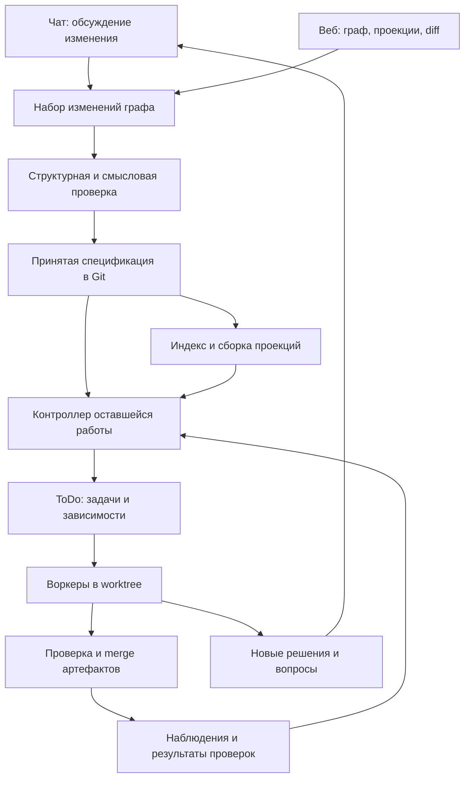

# Граф целевого продукта: исследование архитектуры и инструментов

Дата: 16 сентября 2026. Первоначальное исследование; решения ниже уточнены в последующем обсуждении.

## Принятое решение: Ori

Пользователь выбрал **Go + JavaScript/React + Git + SQLite** и самостоятельный CLI со встроенной веб-страницей, поставляемый как Codex-плагин с исходниками. Актуальная реализация и её границы описаны в [README Ori](../../plugins/ori/README.md). Первоначальные предложения про Node-ядро, зависимости от существующих плагинов и отдельную orchestration-систему ниже сохранены как история исследования, а не как текущая спецификация.

- **Atlas**: JSON/Markdown-граф в Git — источник истины; произвольные компоненты, схемы и типизированные связи, включая циклы.
- **Scout**: локальный SQLite FTS5 и multilingual MiniLM через pure-Go inference. Модель загружается автоматически; Python и отдельный сервер не требуются.
- **Lens**: переносимый снимок проекции с исходными файлами графа, ограничениями и digest. Граф и исходники не обязаны находиться на одной машине или совпадать коммит в коммит.
- **Forge**: исполнение фиксированной проекции в отдельном Git worktree с сохранением попыток, вопросов и результатов проверок. Политика CI, деплоя и слияния веток остаётся за проектом.
- **Desk**: React + React Flow + ELK, встроенные в Go-бинарник. Основной агентный интерфейс — короткие скиллы `$ori:*` и MCP.

Реальная проверка модели на macOS arm64: 384 измерения, русский запрос к английскому тексту — cosine 0.796 против −0.035 для нерелевантного текста. Загрузка около 465 MiB, пиковая память около 1.92 GiB. Это проверка конкретного сценария, не обещание производительности на произвольном графе.

## 1. Вывод

**Рекомендую самостоятельное локальное приложение с веб-интерфейсом, общим доменным ядром и тонким плагином для Codex.** Для первой поставки достаточно локального сервиса и страницы в браузере. Desktop-оболочка — отдельное решение об упаковке, которое можно принять позже.

Основа: **TypeScript + Node.js 24 LTS, React + React Flow + ELK, Git, SQLite + FTS5, поиск на основе Docs, исполнение через ToDo и Codex app-server.** Главная новая часть — контроллер, который сопоставляет целевую спецификацию с проверенными результатами и организует оставшуюся работу.

Это выбор под текущий контекст: преимущественно один пользователь, локальные репозитории, изменения через чат, асинхронные воркеры. Потребность в командной работе с первого дня и место основного чата ещё не подтверждены. Ниже указано, как эти ответы меняют архитектуру. Без измерений на реальном графе нельзя честно назвать конкретную embedding-модель или графовый движок безусловно идеальными.

## 2. Что именно строим

Основание — прочитанная задача [«Найти оригинал и расшифровку видео»](thread://01a0a64d-28a6-70e0-b189-4d18b6fe6d36?hostId=local) и текущие исходники Docs/ToDo.

Требования из обсуждения:

1. Граф описывает **целевое состояние продукта**. Нода может обозначать окно, сервис, функцию или пользовательскую абстракцию.
2. Сущность состоит из компонентов: продуктовое поведение, дизайн, клиент, сервер, контракты, описание реализации и другие аспекты.
3. Пользователь определяет терминологию. Слово «сервер» не навязывает единую идентичность для игрового дизайна, кода и инфраструктуры.
4. Компоненты бывают текстовыми и строго структурированными. Они могут ссылаться на другие сущности и компоненты.
5. Проекции собирают нужные части графа вместе с влияющими ограничениями. Проекция может агрегировать и разворачивать сущности.
6. Изменения обсуждаются в чате и распространяются по связанным аспектам: продукт, дизайн, контракты, описание реализации.
7. Git или аналог хранит историю; семантический merge выявляет смысловые конфликты и запрашивает уточнение.
8. ToDo хранит направленный граф работ во времени. Работа продолжается, пока пользователь уточняет следующую версию цели.
9. Решения, обнаруженные при реализации и меняющие замысел, возвращаются к человеку.
10. Нужны графовый вьюер и веб-интерфейс.

**Продуктовый граф может содержать циклы. DAG требуется графу зависимостей исполнения.** Нельзя переносить запрет циклов ToDo на модель продукта.

## 3. Результат изучения существующего кода

Это статический анализ исходников и документации; работоспособность всей системы в этом исследовании не проверялась запуском.

| Часть | Что подтверждено исходниками | Что потребуется добавить |
|---|---|---|
| Docs | SQLite, FTS5/BM25, мультиязычные embeddings, объединение рангов RRF | Индекс сущностей/компонентов, ссылки, привязка результатов к ревизии |
| Docs | Хеширование файлов и транзакционная запись фрагментов | Снимки нескольких ревизий и поиск по согласованному снимку |
| Docs | Векторный поиск полным перебором; лимит результата до 20 фрагментов | Отдельный режим анализа влияния с обходом связей и контролем полноты |
| Docs | Фрагменты до 120 токенов модели | Поиск мелкими фрагментами с последующим чтением целого компонента |
| Docs | Автоматические hooks пропускают linked worktree и ToDo workers | Явный доступ воркера к версии спецификации, указанной задачей |
| ToDo | App-server, постоянные task threads, продолжение после вопроса | Сессия редактора спецификации и структурированные операции над графом |
| ToDo | Изолированные worktree, claim, очередь merge, проверки перед доставкой | Проверка актуальности спецификации и семантический review |
| ToDo | Атомарная публикация DAG после preflight | Повторяемая публикация по внешнему ключу без дубликатов |
| ToDo | История попыток и результатов | Привязка результата к требованию, версии и доказательству соответствия |

Источники в репозитории: [индекс Docs](../../plugins/docs/scripts/index.mjs), [контекст Docs](../../plugins/docs/scripts/session-context.mjs), [клиент app-server](../../plugins/todo/scripts/app-server-client.mjs), [Git-доставка](../../plugins/todo/scripts/git-worktree.mjs), [MCP ToDo](../../plugins/todo/scripts/mcp-server.mjs), [pipeline](../../plugins/todo/scripts/pipeline.mjs).

Практический вывод: переиспользовать механизмы исполнения выгоднее, чем заменять ToDo новым orchestration-фреймворком. Поиск Docs пригоден как база, но его текущий файловый контракт недостаточен для версионированной спецификации.

## 4. Сравнение форм продукта

Оценки ниже — инженерный вывод для этого проекта, не результаты производительных тестов.

| Вариант | Преимущество | Цена и ограничения | Решение |
|---|---|---|---|
| Codex-плагин + локальная страница | Самый короткий путь из существующего кода; готовый основной чат | Жизненный цикл и UX сильнее связаны с Codex; нужно определить владельца фонового сервиса | Подходит как первая поставка при независимом ядре |
| Самостоятельный локальный сервис + браузер + MCP | Собственный интерфейс, фоновые работы независимо от вкладки, доступ из Codex | Нужно реализовать запуск, восстановление, сессии и протокол интерфейса | **Основная рекомендация** |
| Electron-приложение | Node и Chromium в одной поставке, естественное переиспользование JS | Более тяжёлая поставка; обновления и подпись приложения | Предпочтительный первый desktop-кандидат при сохранении Node-ядра |
| Tauri-приложение | Системный WebView, нативная оболочка, возможность Rust-ядра | Node-ядро потребует sidecar; сборки под архитектуры и проверка WebView | Выбирать после сравнения упаковки и UI на целевых ОС |
| Серверный веб-сервис | Общий проект, централизованные очереди, доступ с разных устройств | Авторизация, изоляция исполнителей, секреты, синхронизация локальных репозиториев | Если командность нужна с первого дня |
| Чистая браузерная PWA | Установка почти не нужна | Для локальных CLI, Git-процессов и устойчивого фонового исполнения потребуется bridge или сервер | Не самостоятельный runtime для заданного сценария |
| Расширение VS Code | Удобная связь с кодом, редактором и diff | Зависимость интерфейса от IDE | Возможный дополнительный клиент |
| Плагин Obsidian | Удобный вход для работы с текстовыми знаниями | Контроллер реализации, контракты и worker lifecycle всё равно нужно разрабатывать | Если редактирование знаний становится главным сценарием |

Electron действительно разделяет main/renderer и предоставляет Node в main-процессе; Tauri поддерживает внешние исполняемые sidecar-файлы с отдельными сборками под платформы. Это делает Electron более прямым продолжением текущего JS-кода, но не доказывает превосходство по памяти или размеру без замеров. [Electron process model](https://www.electronjs.org/docs/latest/tutorial/process-model), [Tauri sidecars](https://v2.tauri.app/develop/sidecar/).

VS Code предоставляет HTML webview и обмен сообщениями с extension host. Obsidian имеет официальный шаблон плагина; это подтверждает возможность интеграции, а не наличие нужной предметной модели. [VS Code webviews](https://code.visualstudio.com/api/extension-guides/webview), [Obsidian sample plugin](https://github.com/obsidianmd/obsidian-sample-plugin).

## 5. Готовые проекты: что брать, что адаптировать

| Проект | Что уже решает | Применимость |
|---|---|---|
| **OpenSpec** | Спецификации, предложения изменений, дизайн и задачи; Stores для нескольких репозиториев находятся в beta | Ближайший ориентир процесса. Рассмотреть импорт/экспорт; до принятия как ядра проверить компонентную модель и независимость целевых specs от окончания исполнения |
| **GitHub Spec Kit** | Инструментарий разработки от спецификации к плану и задачам | Полезен для структуры сценариев и критериев приёмки; сам по себе не задаёт наш reconciliation-контракт |
| **Beads** | Граф задач и долговременный контекст агента; текущая версия использует Dolt | Альтернатива исполнительному слою. Замена собственного ToDo пока не даёт достаточной выгоды |
| **Graphiti** | Временной граф фактов, происхождение, гибридный поиск | Полезен для наблюдений и памяти; принятую целевую спецификацию следует изменять отдельным управляемым процессом |
| **Microsoft GraphRAG** | Извлечение графа из корпуса и поиск с использованием структуры и обзоров | Возможный инструмент импорта и обзора больших корпусов; не обязательный слой для уже структурированного графа |

Источники: [OpenSpec](https://github.com/Fission-AI/OpenSpec), [Stores beta](https://github.com/Fission-AI/OpenSpec/blob/main/docs/stores-beta/user-guide.md), [Spec Kit](https://github.com/github/spec-kit), [Beads](https://github.com/gastownhall/beads), [Graphiti](https://github.com/getzep/graphiti), [GraphRAG](https://microsoft.github.io/graphrag/).

В просмотренных материалах не найден готовый продукт, подтверждённо закрывающий всю комбинацию требований. Это ограниченный обзор подходящих решений, а не доказательство отсутствия аналогов на рынке. Отдельно важно не описывать нынешний Beads как JSONL-first: его опубликованный контракт уже другой.

## 6. Архитектура ядра

Подход похож на reconciliation loop контроллеров: наблюдать состояние, сравнивать с целью, предпринимать действия и проверять результат. Здесь наблюдения о продукте неполны, а смысловая оценка вероятностна, поэтому нельзя обещать автоматическую сходимость для любого текста. Kubernetes служит источником архитектурного принципа; запуск Kubernetes для локальной версии не нужен. [Controllers](https://kubernetes.io/docs/concepts/architecture/controller/).

Начальная организация — модульный монолит, один владелец мутаций проекта. Основные модули: модель графа, изменения/merge, поиск/проекции, reconciliation, адаптер ToDo, API. Embeddings и layout выполнять вне основного потока обработки UI/API. Независимые модули не означают отдельный микросервис для каждого.

### 6.1. Модель данных

| Объект | Минимальный смысл |
|---|---|
| Entity | Стабильный ID, название, теги; не зависит от имени файла |
| Component | Собственный ID, entityId, typeId, schemaVersion, текст или структурированные данные |
| Relation | ID, тип, ссылки на сущности/компоненты, при необходимости точный путь к полю |
| ComponentType / RelationType | Пользовательская схема и правила проверки; эволюционируют вместе со спецификацией |
| Projection | Селекторы, обходы связей, включаемые ограничения, преобразования результата |
| ChangeSet | Исходное намерение, базовая ревизия, операции, найденное влияние, вопросы |
| Obligation | Требование к артефакту/поведению, область, критерий подтверждения |
| WorkItem | Ссылка на задачу ToDo, обязательства, версия цели, входной контекст |
| Evidence | Проверяемое утверждение, версия спецификации, commit/хеш артефакта, проверка, результат |

Компоненты одного типа могут повторяться. Связи допускают many-to-many. Типы `uses`, `implements`, `constrains`, `provides`, `consumes`, `verifies` — стартовый словарь, который пользователь может расширять.

Тексты описания реализации остаются частью **целевой** модели. Утверждение «такой-то commit реализует это поведение» относится к Evidence. Семантическую близость показывать как найденную связь с причиной и оценкой; использовать её как обязательный контракт только после разрешения в контексте изменения.

### 6.2. Где хранить данные

**Git — канонический источник принятой спецификации.** Предлагаемый формат: небольшой JSON-envelope и Markdown-тела текстовых компонентов. Структурированные контракты — JSON с пользовательской JSON Schema. YAML возможен для удобства автора, но один объект должен иметь один канонический вариант записи.

Логическая структура: `spec/entities/<id>/entity.json`, отдельные файлы компонентов, `spec/relations/<id>.json`, `spec/types/`, `spec/projections/`, `spec/changes/<id>/`. Это предложение формата; название каталога ещё не утверждено.

Раздельные файлы уменьшают пересечения изменений; один общий `graph.json` быстро становится точкой конфликтов. Не требуется создавать файл на каждую функцию: степень детализации определяет пользователь и задача.

Для первого проекта спецификацию можно хранить рядом с кодом, публикуя изменения графа отдельными короткими коммитами. Для нескольких репозиториев — отдельный spec-repo и ссылки на проекты/артефакты через стабильные IDs. Межрепозиторная реализация будет согласовываться поэтапно; общей атомарной транзакции Git между репозиториями нет.

**SQLite разделить логически на два назначения:**

- Восстанавливаемый индекс: сущности, связи, фрагменты, FTS5, embeddings, снимки ревизий.
- Долговременное состояние работы: события, решения пользователя, вопросы, outbox, связь обязательств с задачами, Evidence. Это не кэш; нужны backup/export и миграции. На этапе адаптера история исполнения остаётся в ToDo, а SQLite хранит ссылки на неё.

Базы, embeddings, логи, локальные пути и UI-позиции не коммитить в граф спецификации. Персональные настройки интерфейса хранить отдельно; явно сохранённая общая проекция может быть версионируемой.

### 6.3. Почему сначала без графовой БД

Для идентичности, typed edges, локальных обходов и поиска по ревизии достаточно таблиц связей и recursive CTE. SQLite документирует обход графов через рекурсивные запросы. Полный аналитический graph-query язык пока не является требованием. [SQLite WITH](https://www.sqlite.org/lang_with.html).

| Хранилище | Когда уместно | Решение сейчас |
|---|---|---|
| Git + SQLite | Локальность, прозрачный diff, восстановимые индексы | **Выбрать** |
| PostgreSQL + pgvector | Общий сервер, несколько пользователей и исполнителей | Основной серверный кандидат |
| Neo4j | Сложные многопереходные запросы стали главным workload | Проверять после измерений; versioning спецификации всё равно проектировать |
| Dolt | SQL-таблицы должны иметь собственные branch/diff/merge | Сильная альтернатива Git-файлам при приоритете структурированной БД |
| CRDT / Automerge | Одновременное редактирование и offline sync | Возможный слой черновиков; смысловую проверку не заменяет |

Dolt предоставляет Git-подобное версионирование БД; Neo4j реализует property graph; pgvector добавляет векторный поиск к Postgres; Automerge поддерживает совместное редактирование. Выбор Git+SQLite здесь основан на текущем workflow и стоимости интеграции. [Dolt](https://www.dolthub.com/docs/introduction/what-is-dolt/), [Neo4j](https://neo4j.com/docs/getting-started/appendix/graphdb-concepts/), [pgvector](https://github.com/pgvector/pgvector), [Automerge](https://automerge.org/docs/hello/).

## 7. Поиск и проекции

Нужны два режима: **ответить на вопрос** и **найти последствия изменения**. Второй нельзя ограничивать обычным top-6 поиском.

Предлагаемый pipeline:

1. Зафиксировать ревизию графа и набор доступных источников.
2. Найти явные IDs, пути, endpoint, символы и типизированные ссылки.
3. Обойти значимые связи в нужных направлениях: поставщик → потребитель, ограничение → реализация.
4. Добавить кандидатов из FTS5/BM25 и векторного поиска; объединить ранги через RRF.
5. Расширить найденные фрагменты до целых компонентов и применимых ограничений.
6. Агент оценивает последствия и пробелы. При новых зависимостях расширяет область, сохраняя причины включения.
7. При превышении лимита контекста вернуть неполноту явно и разбить анализ. Не выдавать усечённую область за полную проверку.

FTS5 полезен для терминов и полнотекстового ранжирования, но API paths и символы также требуют точных структурированных индексов. Возможности текстового поиска описаны в [SQLite FTS5](https://sqlite.org/fts5.html).

Проекция должна возвращать `graphRevision`, версии правил/схем, включённые IDs и хеши, причины включения, внешние ограничения, вопросы и `projectionDigest`. Из результата должны быть доступны исходные компоненты. Набор можно закрепить для задачи; свободный семантический запрос без сохранённого результата не является воспроизводимой проекцией.

Пример: проекция роутера выбирает endpoints сервиса, а также правила авторизации, идемпотентности и ошибок. Дизайнерская проекция выбирает состояния интерфейса вместе с ограничениями продукта, влияющими на доступные действия.

### 7.1. Embeddings и векторное хранилище

Первая версия: сохранить мультиязычный MiniLM из Docs как измеряемый baseline. Кешировать вектор по хешу содержимого, модели, её ревизии и способу разбиения; один текст можно использовать в нескольких снимках графа без повторного inference.

В сравнительный прогон включить Qwen3-Embedding-0.6B и BGE-M3. Их карточки подтверждают мультиязычные возможности; они не подтверждают превосходство на наших русско-английских спецификациях. Совместимость выбранной конвертации модели с JS/ONNX runtime и расход памяти проверять отдельно. [Qwen3 Embedding](https://huggingface.co/Qwen/Qwen3-Embedding-0.6B), [BGE-M3](https://huggingface.co/BAAI/bge-m3).

Полный перебор Docs оставить для небольшого корпуса, вынеся вычисления из API-потока. Если измерения покажут проблему: сначала сравнить sqlite-vec и LanceDB. Первый сохраняет SQLite-стек, но пока предупреждает о breaking changes до v1; второй имеет готовый hybrid search, но добавляет отдельный слой хранения. [sqlite-vec](https://github.com/asg017/sqlite-vec), [LanceDB hybrid search](https://docs.lancedb.com/search/hybrid-search/).

Независимо от движка, фильтрацию по ревизии применять до итогового top-k. Общий top-k по всем версиям с последующим отсевом может потерять нужные результаты.

## 8. Изменения графа и семантический merge

Чат создаёт набор предметных операций: добавить компонент, изменить поле, заменить контракт, связать сущности, разделить сущность. У операций есть базовая версия и ожидаемые старые значения/хеши.

Путь публикации:

1. Собрать намерение и затронутый контекст, подготовить полный diff.
2. Проверить схемы, существование ссылок, uniqueness и доменные ограничения.
3. Показать изменение смысла, затронутые компоненты и нерешённые вопросы.
4. Проверить независимым reviewer-контекстом согласованность с текущей целью.
5. Повторно проверить базовую ревизию перед публикацией; при её изменении обновить diff и проверки.
6. Опубликовать весь согласованный набор одним коммитом спецификации.

Прямое редактирование файла тоже возможно, но оно становится черновым входом для такого же процесса. Перетаскивание карточки меняет UI-layout; изменение значения контракта создаёт предметное изменение.

Автоматические изменения допустимы в рамках уже согласованного намерения и правил. Дополнительный ответ человека нужен при смысловом конфликте или новом продуктовом решении, а не при каждом техническом шаге.

Результат reviewer: `pass`, `conflict`, `insufficient_context`, со ссылками на конкретные компоненты и ревизии. Проверка схем использует JSON Schema/Ajv; произвольные пользовательские исполняемые валидаторы — отдельная доверенная возможность. [Ajv](https://ajv.js.org/json-schema.html).

**LLM-review не доказывает отсутствие противоречий.** Структурные инварианты проверяются кодом; семантическая проверка ловит то, что не выражено машинно. Неполнота контекста не должна превращаться в `pass`.

Для публикации ref применять сравнение с ожидаемым прежним commit. Git поддерживает такую проверку через `update-ref`. Низкоуровневое обновление ref не синхронизирует пользовательский checkout само по себе: нужен сервисный checkout/ref либо корректная штатная процедура обновления рабочей ветки. [Git update-ref](https://git-scm.com/docs/git-update-ref).

## 9. Как ToDo приводит артефакты к меняющейся цели

Нужно различать три результата: задача выполнилась; её изменения доставлены; актуальное требование подтверждено. Ни один автоматически не означает два остальных.

Для каждого обязательства хранить состояние вроде `unknown`, `planned`, `running`, `verified`, `stale`, `blocked`. Это состояние достижения цели, а не замена существующим статусам ToDo.

Каждая новая работа получает:

- commit спецификации и digest проекции;
- требования и критерии подтверждения;
- прочитанные компоненты/связи, их хеши и область запросов;
- базовый commit кода и предполагаемую область изменений;
- внешний ключ публикации для защиты от повторного создания задачи.

При завершении сравнить результат с актуальной целью:

- Значимая область не изменилась — проверить и доставить.
- Изменилось совместимое уточнение — выполнить дополнительную проверку.
- Цель изменилась несовместимо — остановить доставку устаревшего результата; сохранить работу и сформировать актуальную задачу/ремонт.

Проверки только уже прочитанных ID недостаточно: после старта могла появиться новая зависимость или новое глобальное правило. Поэтому проверять также изменение membership проекции, областей контрактов и применимых инвариантов. На MVP допустима консервативная переоценка области при каждом изменении графа; точечную инвалидизацию оптимизировать позже.

### Пример

В версии 7 отмена заказа разрешена до оплаты; worker реализует её. В чате принимается версия 8 — отмена после оплаты с возвратом. Меняются продуктовый компонент, UI, API и серверное поведение. Завершение worker по версии 7 сохраняется в истории, но требование версии 8 не становится выполненным. Контроллер ставит недостающую работу; совместимые части предыдущего результата можно использовать после проверки.

### Надёжная публикация задач

Коммит Git, SQLite и ToDo не образуют общую транзакцию. Сначала публикуется цель; её обработка сохраняется в журнале/outbox. После перезапуска контроллер повторяет незавершённую доставку по стабильному ключу. ToDo должен уметь атомарно распознавать уже опубликованный batch по этому ключу.

Текущий публичный `task_batch_create` не предоставляет такого внешнего ключа. Это явный integration gap. Запись «создано» только после вызова оставляет окно дубликатов при падении; локальный mutex это окно не закрывает. Пока контракт не расширен, обещать надёжную автоматическую повторную публикацию нельзя.

Контроллер запускается от принятия новой цели, завершения/доставки задачи, обнаруженного изменения артефакта и восстановления после сбоя. Он учитывает уже выполняемые и запланированные работы. При отсутствии прогресса, исчерпанном лимите попыток/стоимости или неизвестном решении фиксирует blocker и прекращает повторять одинаковый план.

Непосредственно перед merge артефактов нужны актуальная проверка области спецификации и проверки на свежем целевом коде. Внутри одного сервиса сериализовать публикацию спецификации с финальным решением о доставке; внешние Git-изменения обнаруживать и повторно оценивать. Последующее изменение цели закономерно делает часть Evidence устаревшей.

## 10. Чат и runtime агентов

Для собственного чата брать **Codex app-server через stdio**, сгенерировать типы под закреплённую версию CLI и адаптировать существующий клиент ToDo. App-server документирует threads/turns, поток событий, запросы разрешений и пользовательского ввода. TCP WebSocket отмечен в документации как experimental/unsupported, поэтому браузер подключать к нашему API, который общается с app-server. [Codex App Server](https://learn.chatgpt.com/docs/app-server).

Границы: основной чат имеет инструменты графа; исполнитель имеет конкретную задачу и снимок; reviewer имеет diff и контекст проверки. Это роли и контракты, не требование запускать отдельную модель для каждой простой операции.

MCP и HTTP должны вызывать одно доменное ядро. Плагин открывает страницу и предоставляет команды поиска, проекций, изменений и статуса. Собственный чат и Codex могут работать с одним проектом. Поддержка desktop-only инструментов, коннекторов и авторизации в отдельном app-server не предполагается автоматически: нужна проверка доступных capabilities. [Plugins](https://learn.chatgpt.com/docs/plugins).

События UI отдавать по SSE с последовательным ID и восстановлением пропущенных событий; команды — через HTTP. Сохранять вопрос до уведомления клиента. Закрытие вкладки не должно терять вопрос или завершать worker. Интерфейс должен показывать сообщение, контекст вопроса, diff, ход инструментов и результат проверки.

На MVP не добавлять LangGraph/Temporal поверх ToDo. Они имеют собственные механизмы долговременного исполнения, но два владельца retry/checkpoint/claim создадут лишнюю сложность. LangGraph стоит рассмотреть при замене агентного контура; Temporal — при переходе к распределённым процессам с несколькими исполнителями и сервисами. [LangGraph persistence](https://docs.langchain.com/oss/javascript/langgraph/durable-execution), [Temporal workflows](https://docs.temporal.io/workflows).

## 11. Веб-интерфейс и графовый движок

Первый интерфейс: список/поиск сущностей, центральная проекция графа, инспектор компонентов, чат/изменение, очередь работ. У каждого требования видна актуальность Evidence, у изменения — затронутая область.

| Движок | Для чего лучше подходит в этом проекте | Ограничение |
|---|---|---|
| **React Flow + ELK** | Карточки компонентов, порты контрактов, локальные проекции, граф задач | Количество и сложность одновременно показанных React-узлов требуют контроля |
| **Sigma.js + Graphology** | Общая обзорная сеть и навигация по большим графам | Сложный карточный UI придётся строить иначе |
| **Cytoscape.js** | Анализ связей и визуализация сети с готовой graph API | Проверить удобство нужного инспектора и React-интеграции прототипом |
| Собственный Canvas/WebGL | Специальные требования, не закрываемые библиотеками | Слишком высокая стоимость для первого цикла |

React Flow требует внешнего layout; ELK поддерживает размеры узлов, вложенные графы и маршрутизацию рёбер. Layout выполнять в worker и сохранять стабильность позиции при небольших обновлениях. На первом этапе показывать выбранную сущность и её окружение, сворачивать группы; не пытаться одновременно читать весь граф. [React Flow layout](https://reactflow.dev/learn/layouting/layouting), [React Flow performance](https://reactflow.dev/learn/advanced-use/performance).

Sigma использует WebGL и Graphology; документация позиционирует его для тысяч узлов/рёбер. v4 пока обозначена как alpha, поэтому не выбирать её автоматически как production-baseline. [Sigma](https://www.sigmajs.org/docs/). Cytoscape — дополнительный кандидат для сетевого анализа. [Cytoscape.js](https://github.com/cytoscape/cytoscape.js).

Первоначально использовать один React Flow renderer. Sigma добавлять только при подтверждённой потребности в общей карте. Два renderer требуют общего selection, deep links, фильтров, цветовой семантики и тестирования — это заметная стоимость.

Семантическое изменение — через чат/ChangeSet; выбор, фильтрация, раскрытие групп и расположение — обычные действия вьюера. Все сущности доступны через список и поиск, чтобы работа не зависела от чтения плотной схемы.

## 12. Конкретный стек и путь поставки

| Слой | Выбор для первой версии |
|---|---|
| Runtime | Node.js 24 LTS + TypeScript; существующие JS-модули адаптировать постепенно |
| API | Fastify, HTTP-команды + SSE-события |
| Frontend | React + Vite, React Flow, ELK в worker |
| Модель | Стабильные IDs, JSON Schema + Ajv, Markdown для длинного текста |
| Версионирование | Git CLI с аргументами процесса, отдельные worktree для изменений |
| Хранилище | SQLite для индексов и отдельного долговременного состояния |
| Retrieval | FTS5 + embeddings + RRF + обход typed relations |
| Исполнение | Адаптер ToDo; существующие worktree/merge/pipeline механизмы |
| Чат | Codex app-server, versioned protocol adapter |
| Интеграция | Тонкий Codex-плагин/MCP поверх того же ядра |

Node 24 находится в LTS на дату исследования. Fastify подходит к Node/TypeScript API и schema-based validation. Выбор обусловлен совместимостью с существующим кодом; сравнительный benchmark backend-фреймворков здесь не нужен. [Node releases](https://nodejs.org/en/about/previous-releases), [Fastify](https://fastify.dev/docs/latest/).

### Переиспользование без жёсткой связи пакетов

Первый прототип может общаться с существующими Docs/ToDo через их процессы/публичные инструменты. Не импортировать runtime из соседнего `plugins/todo` через относительный путь установленного пакета: плагины должны оставаться самодостаточными.

Когда новый контракт доказан, выделить действительно используемый обоими продуктами модуль или перенести его с сохранением владельца. Плагин должен поставлять необходимые runtime-файлы или обращаться к установленному приложению через явный versioned API; не зависеть от пути marketplace checkout.

Если приложение становится самостоятельным продуктом, его основной код разумнее вести в отдельном репозитории; здесь оставить адаптер в `plugins/<name>/`. Финальное имя и границы пакетов пока не выбраны.

Сервис слушает loopback, проверяет Origin/Host и сессию. MCP/UI не должны предоставлять произвольному сайту возможность запускать команды. Worktree изолирует изменения Git, но не является sandbox для недоверенного исполнения. Для удалённого/многопользовательского режима требуются отдельные credentials и изоляция worker-процессов.

## 13. Что проверить до полной реализации

Ниже — план экспериментов и критерии принятия решения. Это не уже выполненные тесты.

### A. Вертикальный прототип модели

Один пример «заказ → оплата → отмена»: продукт, UI, клиент, сервер и контракт. Через чат изменить правило, собрать две разные проекции и показать один согласованный diff. Схемы и ссылки должны валидироваться; разрешённые циклы продукта не должны ломать вьюер.

### B. Поиск влияния

Подготовить 30–50 изменений с вручную отмеченной затронутой областью: RU/EN, термин «сервер» в разных смыслах, переименование endpoint, новое ограничение, удаление компонента. Сравнить exact+graph, FTS5, FTS5+MiniLM, альтернативные embeddings и добавление reranker.

Измерять полноту найденных последствий, ложные включения, стоимость контекста, p50/p95 времени и RAM. Критические прямые контрактные связи должны находиться детерминированно. Для семантических зависимостей зафиксировать пропуски; ни одна скрытая потеря контекста не должна давать успешный merge.

### C. Изменение цели во время работы

Worker начинает версию 7, пользователь принимает 8. Проверить несовместимую и совместимую правку, появление новой зависимости и изменение глобального правила. Старый результат не должен подтверждать новую цель без проверки; история задачи сохраняется.

### D. Сбой на границах публикации

Прервать процесс после коммита цели, после публикации batch до подтверждения, после Git-merge до записи Evidence. После рестарта не должно быть дубликатов работ, потерянных обязательств или ложного `verified`. Этот эксперимент определяет готовность интеграции ToDo.

### E. Вьюер

Фикстуры 200, 2 000 и 20 000 сущностей с разной плотностью связей; отдельно измерять размер всего графа и число видимых карточек. Проверять поиск, раскрытие окружения, инспектор, переключение проекции, время layout, отклик и память. Это размеры тестовых данных, не заявленные лимиты библиотек.

Если локальные проекции работают плавно, оставить React Flow. Если обязательно нужен весь крупный граф на экране и он не проходит согласованный бюджет отклика, сравнить Sigma на том же наборе данных.

### F. Собственный чат

Проверить streaming, вопрос человеку, разрешение, interruption, reconnect и возобновление thread. Проверить необходимые коннекторы и инструменты в app-server. Только после этого считать собственный чат заменой текущему Codex-сценарию.

## 14. Очерёдность реализации

1. **Модель + Git + read-only вьюер.** Доказать сущности, компоненты, связи и проекции на одном продукте.
2. **Чат → ChangeSet → проверка → принятая цель.** Получить согласованное редактирование графа.
3. **Контроллер → ToDo → Evidence.** Замкнуть цикл на одном реальном изменении; добавить внешний ключ публикации и проверки устаревания.
4. **Восстановление и качество retrieval.** Пройти сценарии сбоев и изменений цели, выбрать embedding/runtime по измерениям.
5. **Поставка.** Локальный сервис + плагин; desktop-оболочка или сервер — по подтверждённому способу использования.

### Что меняет предварительный выбор

- Команда с первого дня: серверный владелец мутаций/очереди, PostgreSQL, роли и worker-агенты; Git остаётся механизмом версии спецификации.
- Только чат Codex: собственный чат убрать из первого релиза, ядро и веб-вьюер остаются теми же.
- Несколько AI-провайдеров обязательны сразу: нужен общий контракт executor и отдельные адаптеры событий/разрешений; MCP сам по себе не унифицирует запуск и resume агентов.
- Строго offline inference: выбор моделей и железа становится блокирующим; локальное хранение не означает локальное выполнение Codex-модели.
- Основной сценарий — редактирование SQL-графа вне файлов: повторно сравнить Dolt с Git+SQLite.

## 15. Проверка соответствия запросу

| Требование | Где закрыто проектом |
|---|---|
| Микс Docs и ToDo | Retrieval/проекции + адаптер исполнения, разделы 3, 7, 9 |
| Граф целевого состояния и компоненты | Модель, раздел 6 |
| Каскадные изменения через чат | ChangeSet и анализ влияния, разделы 7–8 |
| Семантический merge с уточнениями | Reviewer и вопросы, раздел 8 |
| Асинхронность и меняющаяся цель | Ревизии, obligations и Evidence, раздел 9 |
| Графовый вьюер и веб-интерфейс | Раздел 11 |
| Плагин, приложение, сервер, альтернативные хосты | Раздел 4 |
| Выбор реализации и инструментов | Разделы 5, 10, 12 |
| Проверка неопределённостей до большой разработки | Эксперименты A–F |

**Итог:** начинать с самостоятельного локального ядра и веб-интерфейса, опираясь на ToDo и Docs. Уникальную часть системы составляют версия замысла, согласованные изменения, воспроизводимые проекции и контроль оставшейся работы. Именно их следует доказать первым прототипом.
