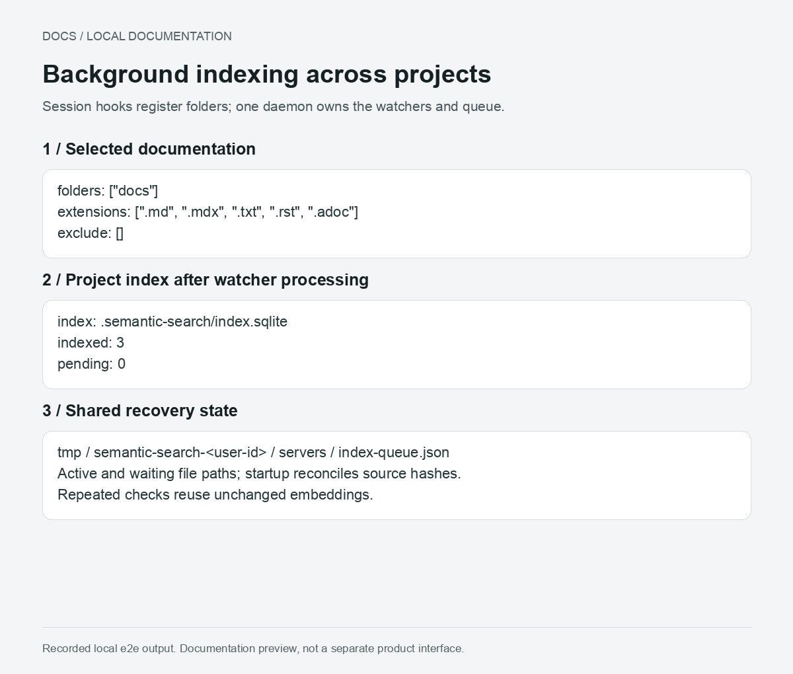
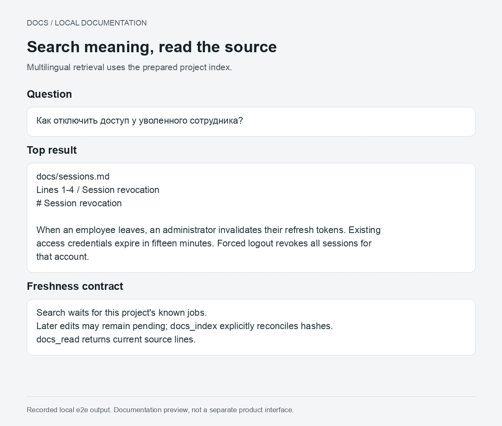
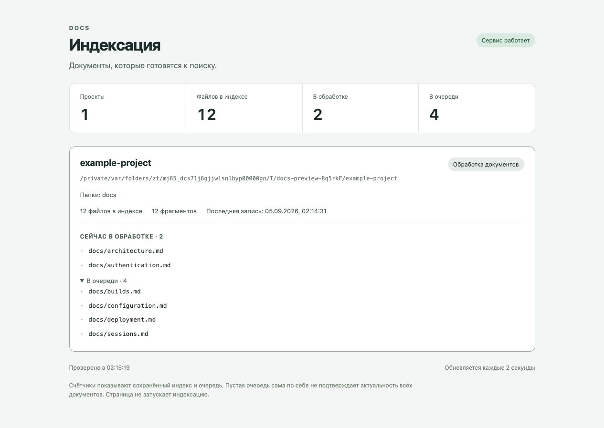
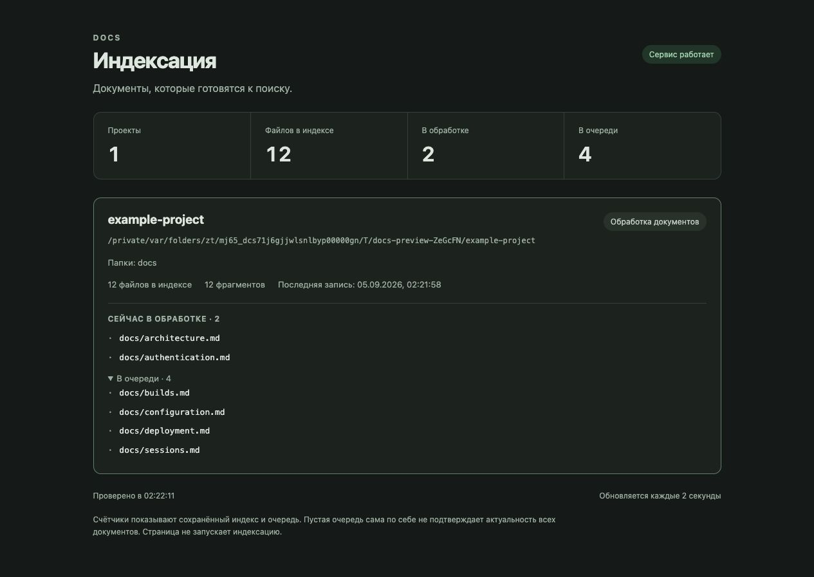

# Docs

A local Codex plugin that makes project documentation available to the agent through skills, MCP tools and context hooks.






Setup and search previews show recorded tool output. The status screenshot shows the actual local dashboard with a test project.

## Use

Install from this marketplace checkout:

```sh
codex plugin marketplace add .
codex plugin add docs@blackbone
```

Install the plugin in Codex, start a new task in a project and invoke `$docs:init`. The skill briefly inspects the current folder, asks which directories contain documentation, and writes `.semantic-search.json` in that exact folder. It does not require Git.

```json
{
  "version": 1,
  "folders": ["docs", "design"],
  "extensions": [".md", ".mdx", ".txt", ".rst", ".adoc"],
  "exclude": ["docs/archive"]
}
```

Folders and exclude prefixes are relative to that file. Nested initialized folders take precedence. Existing configuration is never overwritten by init. Hidden files, common build/dependency directories and symlinks are skipped. Unsupported file types are reported; PDF/Office conversion is not included. UTF-8 documents are indexed in full, up to 4 MiB per file, with token-bounded chunks and source line ranges.

Search with `$docs:find "some thing"`. The CLI also accepts `find`; `search` remains a compatibility alias.

The plugin was renamed from Semantic Search to Docs. Existing `.semantic-search.json`, `.semantic-search/` indexes and the `SEMANTIC_SEARCH_TMP_ROOT` setting remain compatible; no project migration is needed.

## Live status

Use `$docs:status` to open a small local page in Codex. The page follows the system light or dark appearance automatically. It refreshes every two seconds and shows registered projects (plus the current configured project), documentation folders, saved file/fragment counts, active file paths and the waiting queue. Lists display up to 100 paths per project while counters include the full queue.

The dashboard reads the shared queue journal and opens existing indexes read-only. It does not start or restart the indexing daemon, register watchers, scan document contents, download models, or trigger indexing. Counts describe the saved index, not a percentage of current source coverage. When the indexing service is offline, persisted work is labeled as interrupted/recovery state. Read and connection errors are shown explicitly.

Its separate server binds only to `127.0.0.1`, uses a private unguessable URL, accepts only read requests and rejects foreign browser origins/Host headers. No external assets or document contents are served. Keep the local URL private; anyone with it on the same computer can view project and file names. The server exits after two minutes without page requests; reopening the skill returns a fresh working URL. Its metadata/logs live in the shared temporary cache.

## Indexing lifecycle

- One authenticated loopback daemon per user/cache root owns all filesystem watchers, the embedding model and a shared queue. Session hooks register/unregister projects; they never watch or embed files themselves. Multiple sessions share one project watcher set. A final unregister releases watchers after queued work finishes.
- On the first registration of a project in each daemon instance (including restored registrations), watchers are attached before a full SHA-256 comparison against SQLite. This catches offline edits, additions and deletions. Repeating registration or reconciliation is idempotent: unchanged files are not embedded and queued paths are not duplicated or reordered by the scan.
- File events enqueue a unique `(project, path)` entry. Another event moves the pending entry to the tail. A 150 ms debounce coalesces editor saves, capped at one second to avoid indefinite postponement. Renames are handled as deletion plus creation. Directory/configuration events and watcher errors trigger reconciliation and watcher repair.
- Up to eight files are active together. Inference batches contain up to 32 fragments, interleaved across active files/projects; the model executes groups of eight. Completed files are committed transactionally to their project's SQLite, including FTS5 text search. Queries and indexing share a serialized model inference lane.
- An active file keeps its captured content and hash. If it changes during inference, that captured version is still committed; the newer edit waits for a subsequent batch. Intermediate indexed versions are expected.
- A single atomic `servers/index-queue.json` in the shared temporary cache stores registered project roots/session owners and the paths in the active/pending queue, without document content. Restart recovery prioritizes interrupted paths, rereads current contents, prunes unavailable projects, removes deleted files from live indexes, and then resumes queued work. Already committed hashes avoid duplicate embeddings after a crash between SQLite commit and journal update. The first registration scan repairs lost temporary queue state.

`docs_search` waits for this project's known work at request time, not the entire global queue. Later events may remain pending (reported as `pending`). It does not rescan every file on every query for an already registered project. `docs_index` explicitly reconciles source hashes and waits; `docs_status` compares current files with the index without loading a model. `docs_read` reads actual current source lines. Errors are reported instead of silently claiming the index is current.

Search combines multilingual embeddings and SQLite FTS5 keyword ranking. Vector similarity uses an exact local scan, intended for repository documentation rather than millions of chunks. Filesystem notifications are hints, not a strict instantaneous freshness guarantee; use `docs_index` when an explicit reconciliation is needed.

## Local footprint

- Requires Node.js 22.13+ and npm on PATH. The plugin package contains no installed dependencies or model weights.
- Each project's index is `.semantic-search/index.sqlite` (plus SQLite WAL/SHM files). The generated directory contains an ignore-all `.gitignore` and is excluded from watchers/scans. Documents, fragments and vectors stay local; project directories must be writable. Existing temporary indexes from the previous version are rebuilt here on first use.
- Runtime, npm download cache, model weights, queue journal and ephemeral daemon metadata/logs live in `path.join(os.tmpdir(), 'semantic-search-<user-id>')`. On macOS this is usually under `/var/folders`. These directories are private to the current user; loopback requests require an ephemeral token and browser origins are rejected.
- The pinned quantized `Xenova/paraphrase-multilingual-MiniLM-L12-v2` model is downloaded once and shared across projects. First use needs access to npm and Hugging Face; documents and queries are processed locally. Download/install locks and staging directories prevent partial installations from being reused.
- The daemon stays alive while projects are registered or work remains. With no registrations/work it exits after two idle minutes. No launchd/systemd service, startup entry, global npm installation, AGENTS.md edit, or repository hook is installed. After a daemon crash, the next hook/tool request starts it and restores its journal. Abruptly lost host sessions may leave registrations until a matching SessionEnd; this is not an OS session monitor. The loaded model currently remains in memory for the daemon lifetime.
- CLI/tool calls temporarily register their project for the duration of the request. Session hooks keep background watchers registered between requests. Hooks without a session identity disclose the missing registration instead of creating an unremovable owner.
- Removing the plugin removes its skills/hooks/MCP registration, not existing project indexes/configuration or a running detached daemon. The OS may clean temporary data; missing caches rebuild on demand. Project indexes survive tmp cleanup. Removing a project's configuration causes reconciliation to forget its registration.

## Agent integration

Plugin hooks on `SessionStart` (including resume/compact), `UserPromptSubmit`, and `SubagentStart` inject a short requirement to search and read relevant documentation. They register the session with the shared daemon, which schedules initial checking/indexing in the background. `SessionEnd` unregisters that session across its projects. Hook registration does not wait for embeddings or model downloads. Codex requires the user to review/trust plugin hooks before running them. This is an instruction to the agent, not a hard enforcement gate.

Hooks skip linked Git worktrees and ToDo background workers (`TODO_RUNNER_WORKER=1`), without injecting a search instruction or starting the daemon. A copied configuration does not automatically register a worktree as another project. The daemon also rejects worktree session registrations from older hooks and drops saved worktree registrations and their queued work on restart; existing index files are preserved. Explicit search/index calls in a worktree still use its own configured documentation and release their temporary registration when done. Main checkouts and folders without Git keep automatic registration.

MCP tools: `repo_inspect`, `repo_init`, `docs_search`, `docs_read`, `docs_index`, `docs_status`, `docs_dashboard`. Every tool takes the current absolute `cwd`. Calls can also be made with the bundled CLI:

```sh
node /path/to/docs/scripts/cli.mjs inspect
node /path/to/docs/scripts/cli.mjs init docs design
node /path/to/docs/scripts/cli.mjs find 'How are sessions revoked?'
node /path/to/docs/scripts/cli.mjs dashboard
```

The CLI always uses its working directory. `SEMANTIC_SEARCH_TMP_ROOT` can override the cache root for isolated tests. Package and model dependencies are pinned; model metadata/license: https://huggingface.co/Xenova/paraphrase-multilingual-MiniLM-L12-v2 . Transformers.js: https://huggingface.co/docs/transformers.js/v3.8.1/en/index .
