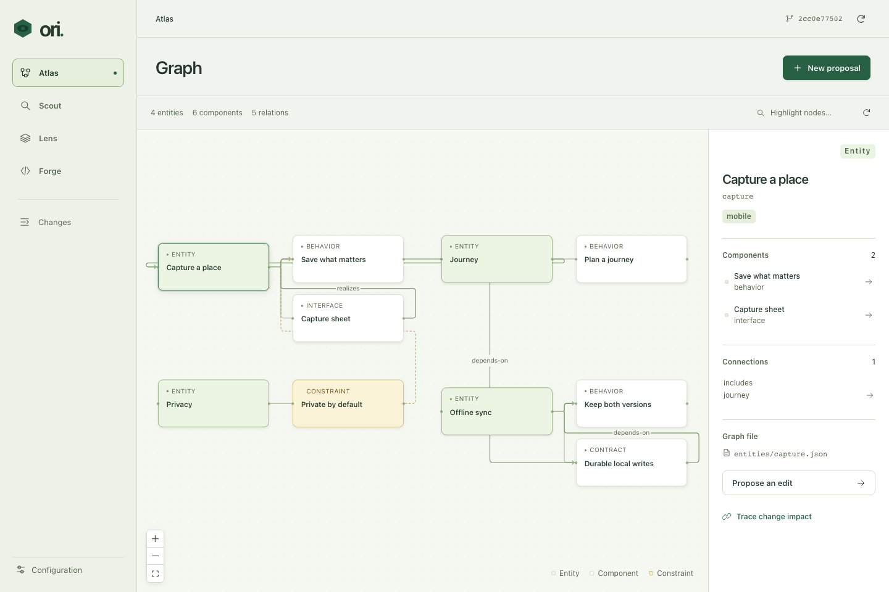
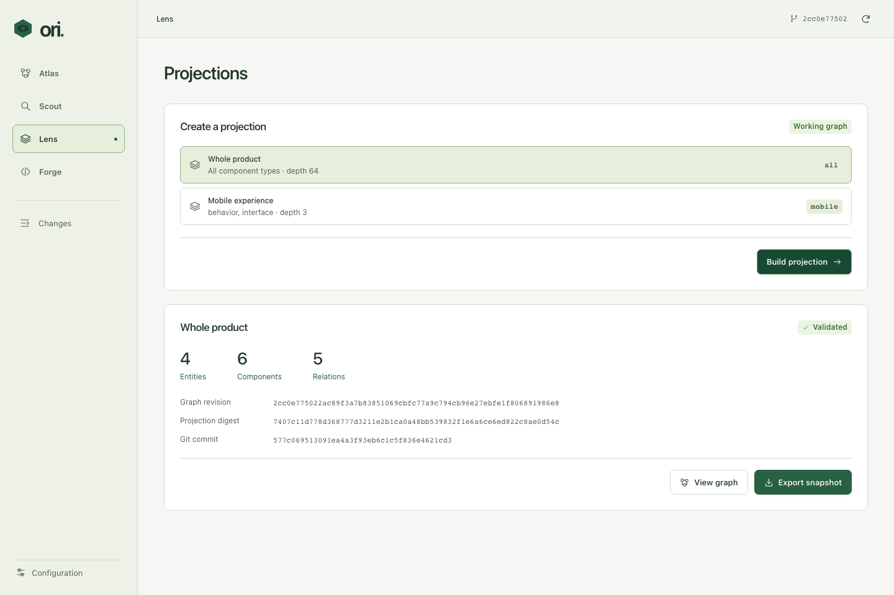

# Ori

Git-native product graphs, local semantic search, portable projections and isolated source execution.

Ori keeps three independent layers: **graph files → projection artifact → source code**. Edit the graph locally, export a projection from a working tree or Git revision, and use that artifact in another checkout or on another machine. Source generation can cover an accumulated change across many graph commits.

## Installation

From this marketplace:

```sh
codex plugin marketplace add blackbone/codex-marketplace --ref main
codex plugin add ori@blackbone
```

Then invoke **`$ori:install` in the target project**. The skill runs the bundled binary, initializes the repository's `.ori` workspace and checks the result. No Go, Node.js, npm or runtime download is needed. Subsequent calls preserve the project's graph and settings.

The skill runs one command; you can invoke the same command directly:

```sh
"/path/to/ori/scripts/ori" --root "/path/to/project" install
```

Installation creates `.ori/INSTRUCTIONS.md` and maintains an Ori-owned block in root `AGENTS.md`, plus `AGENTS.override.md` if that file already exists. Other agent instructions and custom Ori instructions are preserved. Commit these instruction files with the graph and config. Repeating `install` or `init` repairs the integration without duplicating blocks.

Use **`$ori:init`** to initialize or repair project scaffolding, and **`$ori:doctor`** to diagnose configuration, graph and Git ignore problems. Setup does not download the search model, execute source generation or create a Git commit.

The package includes standalone binaries with the embedded React interface for **macOS, Linux and Windows**, each for **x64 (amd64) and ARM64**. `scripts/ori` selects `bin/<os>-<arch>/ori` (`ori.exe` on Windows) and forwards arguments, input and the exit code. It never builds or downloads an executable. An incomplete package reports a reinstall error.

Git is required for repository operations; the default source executor also requires an authenticated Codex CLI. On Windows, use the native PowerShell launcher:

```powershell
& "C:/path/to/ori/scripts/ori.ps1" --root "C:/path/to/project" install
```

The MCP server and lifecycle hooks use the shell launcher on all platforms. On Windows, **Git for Windows' `sh.exe` must be on the Codex process PATH** (usually Git's `bin` directory); installing only the standalone Git executable is insufficient. The PowerShell launcher itself does not require `sh`. Linux binaries use `CGO_ENABLED=0` and need no system C runtime.

For development, from this plugin directory:

```sh
./scripts/build.sh ./bin/ori
./bin/ori --root /path/to/repository install
./bin/ori --root /path/to/repository web
```

To refresh all six distributed binaries after a Go or frontend change:

```sh
./scripts/build.sh --all
```

Building requires **Go 1.27.1+, Node.js 22.16+, npm and tar**, plus network access for pinned dependencies. The build runs in a disposable directory, compiles the frontend once, and cross-compiles all six targets before copying them into `bin/`. Commit those binaries and `bin/checksums.json` together with the source change. The checksum manifest binds the binaries to the source fingerprint; validation rejects missing, damaged or stale artifacts. These checksums detect accidental changes, not a malicious replacement of the package. Development outputs and caches remain ignored.

## Chat integration

The package's `SessionStart` (startup/resume/clear/compact), `UserPromptSubmit`, and `SubagentStart` hooks return a compact graph → projection → sources workflow and a pointer to `.ori/INSTRUCTIONS.md`. They activate only when the current Git worktree contains `.ori/config.json`; nested, unrelated repositories do not inherit Ori context. Hooks read files and Git metadata only. They do not index, generate sources, execute project scripts, rewrite instructions or download models.

Codex requires plugin hooks to be reviewed and trusted before they run ([official hook documentation](https://learn.chatgpt.com/docs/plugins)). Installation preserves those trust settings. Hook commands use the bundled Go binary without Go, Node.js or Python at runtime. If the executable is missing, hooks exit quietly; reinstall the incomplete plugin package. The committed `AGENTS.md` block remains the fallback.

## Usage

| Skill | Purpose |
| --- | --- |
| `$ori:install` | Install the runtime, workspace and chat instructions through one command. |
| `$ori:init` | Initialize or repair `.ori` and graph scaffolding. |
| `$ori:doctor` | Check setup files, graph validity and actual Git ignore rules. |
| `$ori:open` | Open the local graph interface. |
| `$ori:find` | Find intent, constraints and linked components. |
| `$ori:change` | Propose, review and apply graph changes. |
| `$ori:project` | Export a portable projection from a selected revision. |
| `$ori:build` | Execute a projection in an isolated source worktree. |
| `$ori:status` | Inspect graph, proposal and execution state. |

The same operations are available through the CLI and the bundled MCP server. Commands print JSON; build/download progress goes to standard error. Pass `--root` before the command to identify the graph repository explicitly:

```sh
./scripts/ori --root /path/to/graph-repo validate
./scripts/ori --root /path/to/graph-repo doctor
./scripts/ori --root /path/to/graph-repo graph --ref HEAD
./scripts/ori --root /path/to/graph-repo find --query "checkout constraints"
./scripts/ori --root /path/to/graph-repo find --query "checkout" --lexical
./scripts/ori --root /path/to/graph-repo impact --ids checkout,checkout-intent
./scripts/ori --root /path/to/graph-repo project --id all --ref HEAD --out /tmp/product.json
./scripts/ori --root /path/to/graph-repo build --projection /tmp/product.json --source /path/to/source-repo
./scripts/ori --root /path/to/graph-repo status
```

`open` starts or reuses a background local server. `web --port 0` runs it in the foreground and chooses an available local port; `--no-open` prints the address without opening a browser. The UI is embedded in the binary; it does not need a separate frontend server.

## Modules and storage

| Module | Responsibility | Storage |
| --- | --- | --- |
| Atlas | Entities, components, typed links, schemas and graph validation | Git-tracked JSON and Markdown |
| Scout | Full-text and local semantic retrieval, link expansion | Rebuildable SQLite/FTS5 index and embedding cache |
| Lens | Selection, constraints and portable projection snapshots | JSON artifacts with content digests |
| Forge | Source execution and evidence | Isolated Git worktrees and local run records |
| Desk | Graph, search, projection and execution interface | React assets embedded in the Go binary |

```text
repository/
  .ori/config.json            Tracked configuration
  .ori/.gitignore             Tracked rules for local data
  .ori/README.md              Tracked workspace guide
  .ori/state/                 Local SQLite state and execution records
  .ori/projections/           Local exported artifacts
  graph/
    entities/*.json
    components/*.json         Text and/or structured component data
    components/*.md           Optional Markdown bodies
    relations/*.json
    types/*.json              Optional JSON Schemas
    projections/*.json        Selection definitions
```

The graph files are authoritative. SQLite is local state, not the graph database to commit. Initialization preserves existing ignore rules and adds rules for mutable state, generated projection outputs, caches, logs and local binaries. It creates `.ori/state/` and `.ori/projections/`, as well as graph folders with `.gitkeep` files so empty folders survive cloning. Repositories can contain cyclic product relations; execution order is a separate concern.

`init` resolves the Git root when invoked from a project subdirectory. Repeating it restores missing scaffolding while preserving configuration, product files and existing selectors. It refuses a fresh setup over an unrelated existing `graph/` directory. `doctor` checks actual Git ignore behavior and reports ignored metadata/graph files or already tracked local state. It does not create an index or modify files. Root/global ignore rules that conflict with this layout need narrow project-specific corrections; initialization does not replace the user's root `.gitignore`.

### Graph example

`graph/entities/checkout.json`:

```json
{"id":"checkout","name":"Checkout","tags":["store"]}
```

`graph/components/checkout-intent.json`:

```json
{"id":"checkout-intent","entityId":"checkout","type":"intent","text":"Customers can review the total before placing an order."}
```

`graph/components/checkout-accessibility.json`:

```json
{"id":"checkout-accessibility","entityId":"checkout","type":"quality","text":"Checkout must support keyboard navigation.","constraint":true}
```

`graph/relations/checkout-constraint.json`:

```json
{"id":"checkout-constraint","type":"constrains","from":"checkout-accessibility","to":"checkout-intent"}
```

Component types are user-defined. A component can contain `data` validated against `types/<type>.json`. For a longer body use `"body":"components/checkout-intent.md"` instead of `text`; paths are relative to the graph directory. Relations address either entities or components by ID. Entity, component and relation IDs must be globally unique.

### Projections

Initialization creates `graph/projections/all.json`. Additional definitions select entity IDs, component types, tags, relation types and traversal depth:

```json
{"id":"checkout-ui","name":"Checkout interface","entities":["checkout"],"types":["intent","quality"],"relationTypes":["depends-on","constrains"],"depth":4}
```

Constraints are included even when ordinary selection filters exclude them. An exported artifact retains its graph revision, selected objects, selection reasons and original graph files. Its digest protects against accidental alteration; it is not a cryptographic signature. Transport an artifact explicitly when generation runs elsewhere. The source checkout and the graph checkout do not have to share commits.

## Configuration

`.ori/config.json` starts with:

```json
{
  "version": 1,
  "graph": "graph",
  "embeddings": {"provider": "local"},
  "executor": {
    "maxAttempts": 2,
    "timeoutSeconds": 1800
  }
}
```

`embeddings.provider` accepts `local` or `off`. `find --lexical` bypasses model inference for that request. `executor.command`, when supplied, is an argument array for a custom executor; `executor.checks` is an array of command argument arrays. Commands run without an implicit shell. Configure checks appropriate to the source project before relying on generated changes.

### Local model

The first semantic search automatically downloads the pinned multilingual MiniLM model and tokenizer, approximately **487 MB** in total. Files are verified by SHA-256 before loading. Downloads and inference run locally inside the Go process; search text is not sent to a model service. Allow approximately **2 GiB RAM** for inference, based on the measured macOS arm64 smoke run. A first query includes download and model initialization time, and CPU inference can be slow on large graphs. Lexical search remains available without the model.

The model cache lives under `$PLUGIN_DATA`, or the OS user cache when that variable is absent. Executables stay in the installed plugin package. Project indexes and run state live under `.ori/state`. No model weights, local state or credentials belong in the plugin package.

## Changes, execution and boundaries

Graph proposals preserve their base revision. Review must evaluate product meaning, affected links and constraints; schema validity alone is not semantic approval. Applying a proposal checks that its base still matches the working graph. A concurrent edit requires reconciling and reviewing a new proposal.

Source work uses a fixed projection snapshot and an isolated Git worktree. Execution records retain the projection and source evidence so that a successful historical run does not imply that a newer graph is satisfied. Inspect configured checks and the resulting diff before incorporating source changes. Ori does not define a deployment pipeline or merge policy for the source repository.

Run states distinguish `preparing`, `running`, `generated` (no checks configured), `verified` (all configured checks passed), `waiting` (product questions), `failed` and `canceled`. A waiting run is retained for inspection; start an explicit new build with `--intent "answers and context"` to continue with answers. Failed attempts within a run are bounded by `maxAttempts`. There is no scheduler or automatic resume service in this version.

### Custom executor protocol

`executor.command` runs directly in the isolated source worktree. Standard input contains a JSON build request with `projection`, the absolute `sourceRoot`, resolved source `baseRef`, and optional `previous` projection and `intent`. `ORI_INPUT` names the immutable copy of the same request. The environment also includes `ORI_RUN_ID`, `ORI_ATTEMPT`, `ORI_REPORT` (an optional output file), and `ORI_FEEDBACK_FILE` (an absolute path to UTF-8 feedback from the preceding attempt, empty on the first attempt). To report a result, write to `ORI_REPORT`:

```json
{"status":"complete","summary":"Implemented the supplied projection","questions":[]}
```

Use `"status":"needs_input"` with concrete `questions` when product intent is missing. A custom executor may finish with exit code zero without a report; configured checks still determine verification. The default Codex executor requires a structured report. Failed commands and check output are retained as run evidence and passed into bounded retries.

Checks must leave the candidate source tree unchanged; configure generated test/build outputs in the source repository's ignore rules. A successful source tree is captured without running Git commit hooks after checks. Put required validation commands explicitly in `executor.checks`.

The local web service is intended for loopback use. Treat executor configuration as trusted local code: it can launch programs with your account's permissions. The default Codex executor sends its supplied generation context to the configured Codex service; local embeddings do not make source generation an offline operation. Keep sensitive graph material out of exported projections unless the receiving environment is authorized to use it.

## Screenshots





## Development and validation

```sh
./scripts/test.sh
```

This builds the embedded interface and binary, runs the Go tests, and exercises initialization, graph validation, lexical retrieval and projection export in a temporary Git repository. The default suite does not download the embedding model or call a hosted source executor. The repository-wide `make test` also checks marketplace contracts, executable formats for all six targets, SHA-256 checksums and source freshness. The `Ori bundled binaries` CI workflow runs native smoke checks on macOS, Linux and Windows, including the shell launcher, Windows PowerShell launcher and hooks; it does not rebuild the binaries. Cross-compilation alone does not verify native runtime behavior on every architecture. Dependency versions are pinned in `go.mod`, `go.sum` and `web/package-lock.json`.

To explicitly download and exercise the local model, including Russian-to-English ranking and long-input handling:

```sh
ORI_MODEL_SMOKE=1 CGO_ENABLED=0 go test ./internal/ori -run '^TestLocalModelSmoke$' -count=1 -v
```

### Appearance and keyboard navigation

The web interface follows the system light or dark appearance, including changes while it is open. Dialogs keep keyboard focus inside; Escape closes them when no operation is running.
