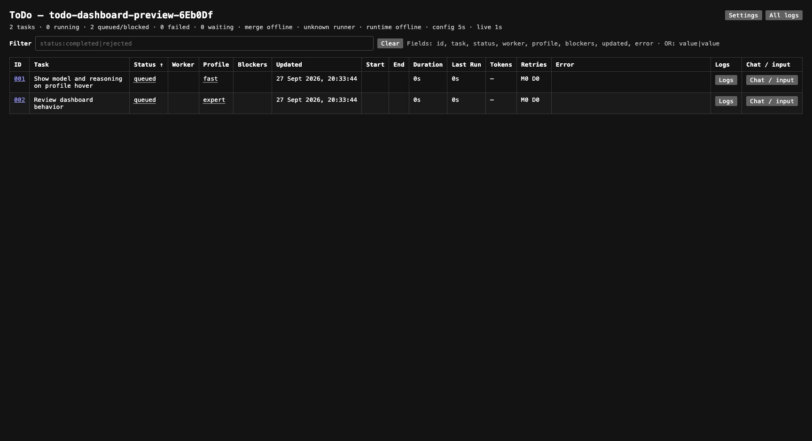

# ToDo for Claude Code

ToDo gives Claude Code a durable, repository-local task queue with automatic
atomic decomposition, Ponytail full task formation and execution, connector and
Git preflight, atomic DAG publication, optional repository-defined execution
pipelines, isolated worktree delivery by default, optional single-branch
execution, persistent per-task Claude sessions, tier-escalating retries, a local
rebase merge queue, per-attempt telemetry, and a live dashboard.

This is the Claude Code fork of the [Codex ToDo plugin](../todo/README.md). Both
forks use the same `.todo/` state, tasks, pipelines, routing rules, MCP tools,
dashboard, and model profile names; only the host integration and the executor
differ. The Codex README describes the shared behavior in full: routing,
Ponytail lifecycle, Git execution and merge queue, single-branch execution,
pipelines, dashboard, and records.



## Install

Add the marketplace and install only this plugin:

```text
/plugin marketplace add blackbone/codex-marketplace
/plugin install todo@blackbone
```

Requirements: Node.js 22+ and Git on the `PATH` of the Claude Code process, and
the `claude` CLI for background workers. On Windows the workers need the native
`claude.exe` (an npm `claude.cmd` shim cannot be started without a shell); set
`claudeCommand` to its full path if it is not on `PATH`.

Installing ToDo does not activate it in every repository. In a target Git
repository, invoke `/todo:init`. Initialization creates `.todo/config.json`,
excludes `.todo/` from Git by default, installs a managed routing block in the
root `CLAUDE.md` without replacing other rules, and claims the repository for
Claude Code. Use `/todo:start` to start the detached runner and
`/todo:dashboard` to retrieve its local URL.

## Usage

| Skill | Purpose |
| --- | --- |
| `/todo:init` | Activate ToDo in a Git repository. |
| `/todo:route` | Route project changes into tasks; perform tool setup directly. |
| `/todo:create` | Create an explicit self-contained task. |
| `/todo:run` | Claim and execute a task in the current session. |
| `/todo:start` | Start the runner and return its dashboard URL. |
| `/todo:stop` | Stop the runner. |
| `/todo:supervise` | Inspect runner health and failed tasks on request. |
| `/todo:status`, `/todo:list`, `/todo:get` | Inspect tasks, workers, and results. |
| `/todo:dashboard`, `/todo:workers` | Show the dashboard or worker state. |
| `/todo:update`, `/todo:retry`, `/todo:reopen`, `/todo:cancel` | Manage an unclaimed or closed task. |
| `/todo:artifact-add` | Attach files, images, URLs, code, or text context. |

### How routing works

In an activated repository, `/todo:route` applies to repository mutations even
when ToDo is not mentioned explicitly. Read-only analysis, planning, status, and
inspection stay in the current session.

<!-- TODO TOOLING EXCEPTION START -->
Classify each operation by its purpose and effects, not just its file path or the fact that a plugin/tool is invoked.
- Perform Claude Code plugin and auxiliary tool installation, configuration, updates, diagnostics, tool connections, and creation or refresh of their service configurations, indexes, and caches directly, without creating a ToDo task. This includes service files inside the repository.
- Run local builds, tests, application launches, previews, and runtime inspection directly in the current thread when they do not edit product code, project documentation, application dependencies, or build/CI/CD/deployment configuration. Generated local build outputs, caches, logs, test reports, and disposable runtime data are allowed effects of this verification; they do not require a ToDo task.
- Local verification requires no task creation, task_preflight, task_run_start, or task_run_finish, including while another task owns a single-branch reservation. Do not add task dependencies, wait for task completion, stop a worker, or release/recover its reservation merely to run local verification. Respect actual tool/resource conflicts (for example, an occupied Editor or output directory); use separate local outputs where needed and report the concrete conflict if it cannot be avoided.
- Changes to product code, project documentation, application dependencies, build scripts/settings, CI/CD, or deployment still require ToDo, even when performed through a plugin or described as "tooling setup" or "verification". Route any required implementation fixes separately; the local verification exception does not authorize source edits, dependency upgrades, Git mutations, publishing, or deployment. Developing a plugin as the repository's product is also a project change.
- Split mixed requests: perform tool setup directly and route project changes through ToDo. Complete prerequisite setup before publishing dependent project tasks; a setup failure must not publish tasks that depend on it.
- A user's request to configure a tool already authorizes that setup; do not ask for a separate routing confirmation. Preserve existing permission, access, authentication, and hook-trust requirements; never approve hook trust on the user's behalf.
- Examples: docs:init writing .semantic-search.json and indexing docs/ is direct; configuring another Claude Code plugin or MCP connection is direct; editing source code or docs/ through a plugin requires ToDo; changing a build pipeline or deployment under the label "tooling setup" requires ToDo; connecting a documentation search tool and then rewriting project documentation splits into direct setup and a ToDo documentation task.

The tooling and local verification exceptions do not expand a claimed worker's assigned task scope, repository access, permissions, or authority to create follow-up tasks. Perform tool setup or local verification only when required for the assigned task and already allowed by its restrictions; never use these exceptions to alter unrelated repositories, managed routing instructions, or .todo runtime state.
<!-- TODO TOOLING EXCEPTION END -->

In an activated repository the session hooks inject the routing policy and the
Ponytail full contour, so project mutations are routed through ToDo even when
ToDo is not mentioned. The contour arrives through a second hook entry because
Claude Code caps each injected context at 10,000 characters.

### Dashboard in Claude Code

The plugin ships a Claude Code mod (`mod/register.tsx`) that draws the
dashboard natively, in the terminal and in the desktop Code tab. Open it with
`/todo-dashboard`, or from the band above the prompt: it always shows a
colored count per task state (running, waiting, failed, queued, blocked,
merging) beside a button with the state's colored circle that opens the table
filtered to that state, and **ToDo** opens it unfiltered. The pane has the web dashboard's
task table and columns, the task graph, one window per task (ⓘ in the
table, **Details** in the graph) with Overview, Chat and Logs tabs, header sorting, the same filter syntax
(`status:failed|blocked profile:advanced text`) with status and profile chips,
task files, chat with reply, steer and continue, task and runner logs, and the
settings form. The desktop also draws status tiles, a progress bar and worker
lanes. The status line carries a task summary, and toasts report tasks that
fail, wait for input, or complete.

**Graph** (desktop only; the terminal has no Graph button) draws the
dependency graph: arrows run from a blocker to the task that waited for it,
columns follow dependency depth, colors follow status. It shows the active tasks
with everything they depend on, the whole history, or one task's ancestors and
dependents (**Focus**), as a pipeline view of task cards. It opens at 100%
centered on running work (else a task waiting for input, else a failed one).
Pan and zoom with the buttons above it (arrows, − / +, Fit, Center, 100%). The drawing
is a script-less image, so it takes no mouse drags, wheel zoom or clicks: the 🔍
button beside each task in the table opens the graph centered on that task, and
**Details** opens the selected task's window.

Hovering a card lights it, its dependencies and the tasks they reach in their
status colors and fades the rest; hovering an arrow lights it and its two cards.
Running tasks glow blue slowly, failed ones red quickly, tasks waiting for input
amber. The graph redraws only when a task's status, title or dependencies
change, not while a running task's duration or tokens grow, so hover highlights
stay.

The table and the graph fill the pane's height. The surface reports its size
only in cells, so on the desktop **Taller** / **Shorter** tune the fit; the
setting is kept across sessions.

Closed tasks keep their dependencies in `.todo/history`; records written before
dependencies were kept fall back to the `## Dependencies` section of the task
body, so older history may lack edges.

The mod polls `scripts/mod-api.mjs` every three seconds. Reads and settings
saves work without a runner; task input goes through the running dashboard and
keeps its same-origin checks. Mods are not sandboxed: the mod runs with Claude
Code's own access, like the plugin's hooks.

### Background workers

Each background attempt is one `claude -p` process in stream-json mode, started
in the task worktree with `TODO_RUNNER_WORKER=1`. A task keeps one Claude
session: the first attempt creates it with `--session-id`, retries, answers,
reopen, and merge repair continue it with `--resume`. The worker returns its
result through `--json-schema` structured output. Tool calls, token usage
(including cache reads and writes) and failures are recorded in the same
attempt ledger and usage files as the Codex fork. **Steer** in the dashboard
queues an instruction into the running process. Claude Code has no session
archive or remote title API, so those steps are no-ops and the dashboard title
status reads `unsupported`.

Worker permissions are the Claude Code equivalents of the Codex sandbox modes
selected by `codexSandbox` in `.todo/config.json`:

| `codexSandbox` | Claude worker |
| --- | --- |
| `read-only` | `--permission-mode dontAsk` with read-only tools (Read, Grep, Glob, web reads, read-only Git) |
| `workspace-write` (default) | `--permission-mode acceptEdits`: file edits are accepted inside the worktree only; shell commands run in the Claude Code sandbox (`failIfUnavailable`, no unsandboxed fallback, strict empty network allowlist), so writes stay in the worktree and network access is off. Other tools that would need a prompt are denied, except the ToDo MCP server |
| `danger-full-access` | `--permission-mode bypassPermissions` without the sandbox |

### Interactive runs

`/todo:run` claims a task for the current session. Claude Code sends no session
or turn in MCP requests, so the `SessionStart` and `UserPromptSubmit` hooks
record the session ID and prompt ID under the Claude process ID in the plugin
data directory; the ToDo MCP server of the same session reads them. The `Stop`
hook releases only a claim of the exact session and prompt.

### Host claim

A repository is claimed by one host at a time; `host` in `.todo/config.json`
records it, and a repository without it belongs to Codex. While a live process
of the other host works in the repository (its runner PID from
`.todo/daemon.json`, or the PID of a task claim), ToDo in Claude Code stays
disabled: the session hook says so and task-changing MCP tools fail with
`HOST_MISMATCH`. Reads keep working. When that PID is dead, the first
task-changing call, runner start, or activation claims the repository for
Claude Code. Interactive claims left by Codex become `waiting-input`, and Codex
threads are not resumed: the next attempt starts a new Claude session. To hand a
repository over, stop the runner from the host that owns it.

## Configuration

The configuration file is shared with the Codex fork. Fields specific to this
fork:

- `claudeCommand` — the Claude CLI used by workers (default `claude`).
  `codexCommand` belongs to the Codex fork and is ignored here.
- `models` — either the legacy Codex profile array or a map keyed by host.
  This fork reads and writes `models.claude`; without it, the built-in profiles
  below apply. A plain array stays with Codex.
- `codexSandbox` — the worker permission mode described above.

Built-in profiles keep the Codex names and task roles:

| Profile | Model | Effort |
| --- | --- | --- |
| `mini` | `claude-sonnet-5-5` | low |
| `fast` | `claude-sonnet-5-5` | medium |
| `standard` | `claude-sonnet-5-5` | high |
| `medium` | `claude-sonnet-5-5` | xhigh |
| `proven` | `claude-opus-5-5` | medium |
| `advanced` | `claude-opus-5-5` | high |
| `expert` (default) | `claude-opus-5-5` | xhigh |
| `ultra` | `claude-opus-5-5` | max |

Profiles are edited in the dashboard settings, both in the Claude Code pane
(`/todo-dashboard` → Settings) and in the web dashboard: add, rename, remove
(not while open tasks use the profile), and choose each profile's model,
effort, and description. Saving writes `models.claude`; until then the
built-ins below apply.

Profile models come from the Claude CLI model list: the models the CLI
reports to an SDK `initialize` request (what `/model` offers), with each
model's effort levels. Reading it makes no model request; it is cached in
`.todo/claude-models.json` for an hour. A profile may name a model id, an
alias such as `opus`, or a dated id's base (`claude-haiku-4-5`). The settings
refuse a model outside the list or an effort the model does not support, and
while any profile is invalid `runner_start` and the dashboard **Start runner**
button return `start-blocked` with the problems; the runner does not start until
the profiles are fixed in settings. The list says which models the CLI knows,
not which the account may use: a listed model that needs usage credits still
fails at the first task attempt.

Built-ins use only Sonnet and Opus. Haiku and Fable stay in the executor
catalog for custom profiles; saved former Haiku and Fable built-ins are offered
for migration by `model_profiles`.

Profile updates only recommend built-ins at their declared supported effort;
unavailable tiers are not silently downgraded.

The model catalog is built in, because the Claude CLI does not list models;
preflight checks that the CLI runs (`claude-command`). Pipelines keep their step
types (`codex-exec`, `codex-thread`); both run as Claude sessions here.

## Limitations

- Workers run with the current user's local permissions. `workspace-write`
  requires the Claude Code sandbox (macOS, or Linux/WSL2 with bubblewrap and
  socat); where it is unavailable, such as native Windows, worker turns fail
  instead of running unsandboxed. Choose `danger-full-access` there explicitly.
  Interactive runs use the permissions of the current session.
- `danger-full-access` uses `bypassPermissions`, which Claude Code refuses when
  running as root outside a recognized sandbox.
- Dashboard **Send answer** for a live question is unavailable: `claude -p` does
  not ask questions mid-turn, so a worker that needs input finishes with
  `requiresInteractive` and the answer continues the task in a new turn.
- Codex threads and Claude sessions are not interchangeable; a host switch loses
  the previous conversation, not the task, its worktree, or its history.
- The local dashboard can expose repository context, prompts, logs, and errors.
  Do not commit `.todo/` runtime state or place secrets in task descriptions.
- Updating the plugin requires a new Claude Code session to reload skills,
  hooks, and the MCP server; the runner restarts at a safe task boundary.

## Development

```bash
npm run test:todo-claude
```

The suite covers the host claim, the Claude executor against a fake `claude`
CLI, a daemon run end to end, and the executor-independent ToDo tests. Daemon
scenarios that drive the Codex app-server protocol run in the Codex fork.

## License

[MIT](../../LICENSE)
