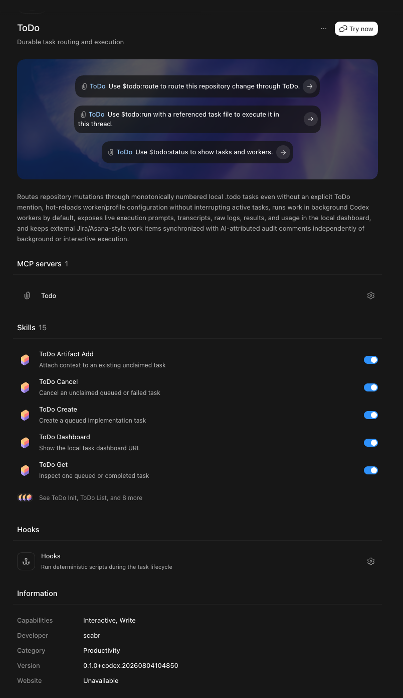
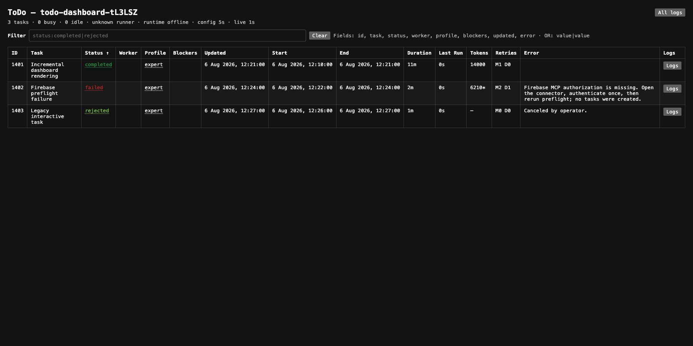

# ToDo

ToDo gives Codex a durable, repository-local task queue with Ponytail full task
formation and execution, connector and Git preflight, atomic publication,
isolated worktree delivery, persistent per-task Codex threads, configurable
background workers, per-attempt retry and usage telemetry, and a live dashboard.

| Plugin details | Local dashboard |
| --- | --- |
|  |  |

## Install

Add the marketplace and install only this plugin:

```bash
codex plugin marketplace add blackbone/codex-marketplace --ref main
codex plugin add todo@blackbone
```

Installing ToDo does not activate it in every repository. In a target Git
repository, ask Codex to use `$todo:init`. Initialization creates
`.todo/config.json`, excludes `.todo/` from Git by default, and installs a managed
routing block in the applicable root `AGENTS.md` without replacing other rules.
The bundled MCP launcher resolves its runtime from the installed plugin directory,
so local marketplace installs do not depend on an inherited `PLUGIN_ROOT` value.

Use `$todo:start` to start the detached runner and `$todo:dashboard` to retrieve
its current local URL.

## How routing works

In an activated repository, `$todo:route` applies to repository mutations even
when ToDo is not mentioned explicitly. Read-only analysis, planning, status, and
inspection stay in the current thread.

Before any task is created, the interactive agent makes one minimal ping or
fetch through every connector the task will need. It passes only normalized
connector, scope, access, and outcome reports to `task_preflight`; credentials
and probe responses are not stored. The preflight also checks the current plugin
runtime, configuration, Codex command, Git root, target branch, identity,
worktree support, and requested delivery. Authentication or any other required
failure is resolved interactively before task creation is attempted again.

The resulting receipt is short-lived and bound to the repository and effective
configuration. `task_batch_create` validates it and publishes the whole batch,
including a one-task batch, behind a publication lock. A failed preflight,
expired or mismatched receipt, missing required capability, or failed publication
creates zero runnable tasks.

Tasks run in background workers by default. Choose interactive execution only
when requested or when a worker records a concrete current-thread-only capability
requirement. A claim token prevents background and interactive execution of the
same task at the same time.

A claimed worker implements its task directly and cannot create follow-up ToDo
tasks by default. Task creation is available only when the user explicitly asks
for delegation and the parent task records `allowWorkerTaskCreation: true`.
Authorized follow-up tasks automatically depend on their parent, record its task
ID, and cannot inherit the permission. For example, a user may explicitly ask a
`fast` verification task to create an `expert` implementation task from confirmed
findings.

Task IDs are monotonically increasing and are not limited to three digits.
Dependencies keep tasks blocked until their prerequisites complete. Failed tasks
can retry automatically according to configuration or manually through
`$todo:retry`.

The default execution backend is one long-lived Codex `app-server` process per
repository. Each task receives its own persistent Codex thread, and its thread
ID is stored with the task. Retries add turns to that same thread, so Codex can
reuse the task conversation and repository findings instead of starting a fresh
`codex exec` session. Retry turns send only a compact continuation with the
recorded failure instead of repeating the original task body and execution
contour. The runner creates or unarchives the saved thread when an attempt
starts and archives it whenever that attempt ends, including failure and daemon
shutdown. Retries and `$todo:reopen` unarchive that same thread before the next
turn.

## Ponytail full lifecycle

Every activated session, submitted prompt, and started subagent receives the
same canonical Ponytail full contour together with the routing policy. Task
formation applies it after tracing the real owner, flow, and affected callers.
The task keeps the original user request and acceptance criteria plus a concise
implementation brief: the owner and callers, existing contract to reuse, minimal
path, explicitly excluded alternatives, and minimal validation. The full contour
is not copied into each task body.

The daemon places that same canonical contour before the body sent to every
background worker. `$todo:run` applies it to interactive execution through the
same hook. The brief is treated as the accepted plan, so workers recheck only
necessary or changed facts instead of repeating broad discovery. Model-profile
selection remains unchanged.

Before completing, the same worker or interactive agent reviews its own diff,
removes only unnecessary wrappers, configuration, dependencies, duplication, or
out-of-scope code introduced by that task, and runs the smallest relevant check.
It never removes pre-existing repository code or user functionality merely to
simplify it. This review does not create another task or model run. A retry keeps
the same task body and brief and resumes from the concrete failed fact.

## Skills

| Skill | Purpose |
| --- | --- |
| `$todo:init` | Activate ToDo in a Git repository. |
| `$todo:route` | Route a repository mutation into a durable task. |
| `$todo:create` | Create an explicit self-contained task. |
| `$todo:run` | Claim and execute a task in the current thread. |
| `$todo:start`, `$todo:stop` | Control the detached runner. |
| `$todo:status`, `$todo:list`, `$todo:get` | Inspect tasks, workers, and results. |
| `$todo:dashboard`, `$todo:workers` | Show the dashboard or worker state. |
| `$todo:update`, `$todo:retry`, `$todo:reopen`, `$todo:cancel` | Manage an unclaimed or closed task. |
| `$todo:artifact-add` | Attach files, images, URLs, code, or text context. |

The plugin exposes 18 corresponding MCP tools for preflight, atomic batch
publication, activation, task lifecycle, interactive claims, runner control,
artifacts, status, and workers. Skills are the supported user-facing entry
points; direct tool calls are agent internals.

## Git execution

Each task is assigned a `codex/todo-<numeric-id>-<slug>` branch when it is
created. Before model execution, the runner creates or reuses its isolated
`.todo/worktrees/<task>` checkout and runs the worker there. Workers must not run
mutating Git commands; the runner verifies `HEAD`, stages all task changes, and
creates the task commit.

Delivery is selected per task, with the repository default used when omitted:

| Mode | Result |
| --- | --- |
| `keep` | Remove the clean worktree and keep the committed task branch; remove a no-change branch. |
| `merge` | Fast-forward the target when possible; otherwise cherry-pick the task commit. The runner creates no merge commit, then removes the task worktree and branch. |
| `pr` | Push the branch and create a pull request with `gh`; this mode must be explicitly requested. |

The preflight checks the exact requested mode, including a clean checked-out
merge target or GitHub remote and authentication for a pull request. A Git
failure preserves recoverable state. Delivery is recorded separately and can be
retried without rerunning the completed model attempt.

## Configuration

The default `.todo/config.json` is:

```json
{
  "workers": 4,
  "pollIntervalMs": 2000,
  "configReloadIntervalMs": 5000,
  "dashboardPort": 0,
  "retries": 0,
  "executionBackend": "app-server",
  "gitExclude": [".todo/"],
  "models": [
    {
      "name": "fast",
      "model": "gpt-5.6-luna",
      "reasoningEffort": "medium",
      "description": "Mechanical file operations and exact text insertions."
    },
    {
      "name": "medium",
      "model": "gpt-5.6-terra",
      "reasoningEffort": "medium",
      "description": "Small, bounded edits across a few files."
    },
    {
      "name": "expert",
      "model": "gpt-5.6-sol",
      "reasoningEffort": "xhigh",
      "description": "Most coding tasks and complex implementation work."
    },
    {
      "name": "ultra",
      "model": "gpt-5.6-sol",
      "reasoningEffort": "ultra",
      "description": "Large, high-risk, cross-cutting refactors."
    }
  ],
  "defaultModelProfile": "expert",
  "routingMode": "all-mutations",
  "git": {
    "delivery": "keep",
    "targetBranch": null,
    "remote": "origin"
  }
}
```

`workers` accepts 1–32. Poll and reload intervals accept 250–60000 ms.
`dashboardPort: 0` selects a free local port. `retries` is a non-negative integer
or `-1` for unlimited retries. `executionBackend` defaults to `app-server`;
`exec` is retained as an explicit legacy fallback. `git.delivery` accepts
`keep` or `merge`; pull
requests are an explicit per-task choice. `git.targetBranch: null` resolves to the
branch active at preflight, and `git.remote` defaults to `origin`. The daemon
hot-reloads valid worker, profile, polling, retry, dashboard, execution, and Git
configuration without interrupting active tasks.

Advanced local execution fields `codexCommand` and `codexSandbox` are also
supported. The default sandbox is `workspace-write`. A change to the backend or
Codex command takes effect for newly claimed tasks; existing tasks retain their
snapshotted backend and model profile.

## Dashboard and records

The dashboard shows tasks separately from worker state, including dependencies,
model and delivery retries, timing, attempt-local token usage, coverage, errors,
and links to logs. It patches keyed rows and cells in place and appends log text,
so polling does not rebuild unchanged completed tasks or disrupt text selection,
scroll positions, filters, or controls. Its URL and port are ephemeral; query
`$todo:dashboard` or `$todo:status` instead of bookmarking one. Prompts, readable
transcripts, worker JSONL event logs, results, and metrics remain in `.todo/` for
audit and debugging.

Dependency IDs link to their task Markdown when the referenced task is available.
Canceled lifecycle records are labeled `rejected` in the dashboard. Field filters
accept OR values as either `status:completed|rejected` or
`status:(completed|rejected)`; clicking multiple status or profile values builds
the same `|` expression.

The dashboard is local operational tooling, not an account-quota display. Usage
schema v2 is stored separately for each attempt. It contains numeric turn totals,
including cached-input tokens reported by `app-server`, observable tool
call counts, and payload byte counts. Coverage is `full`, `partial`, or `none`;
the dashboard marks partial totals with `*`. Raw model-request telemetry is held
only long enough to reduce it to these numeric statistics and is never persisted.
Existing `promptBytes`, usage schema v2, and the attempt ledger expose the actual
cost and retry count of the full contour. ToDo does not claim token savings
without a comparable measured baseline. `app-server` currently exposes
turn-level usage rather than transport-request retry counts, so request-level
telemetry is marked unavailable instead of being inferred.

Model attempts and Git delivery attempts are separate immutable ledger entries.
Each records its UUID, ordinal, retry trigger and predecessor, classified status,
timing, and error kind; model attempts also link their usage record. Automatic
retry is fail-closed: only a known transient failure is retried in the same model
or delivery phase. Unknown, authentication, permission, cancellation, preflight,
and interactive failures wait for an explicit fix or manual action.

## Runtime updates

The daemon publishes the version and fingerprint of the installed runtime. A
hook or MCP call that sees changed manifest, MCP, hook, script, or skill content
requests a safe restart. The old daemon stops claiming new tasks, lets active
tasks finish, and exits; an idle daemon stops immediately. The next hook or MCP
boundary starts the new runtime and loads the current repository configuration.
The handoff also recognizes a verified previous ToDo cache or local package,
including an already-evicted cache directory, without trusting an unrelated PID.

Already loaded host skills and hooks cannot be replaced inside an existing Codex
session. Start a new session after updating the plugin so those definitions and
the installed MCP process also come from the new package. An incomplete runtime
or invalid configuration reports `update-blocked` instead of interrupting work.

## Safety and limitations

- ToDo executes Codex with the current user's local permissions and configured
  sandbox; it is workflow coordination, not isolation.
- The local dashboard can expose repository context, prompts, logs, and errors.
- Do not commit `.todo/` runtime state or place secrets in task descriptions.
- Stopping the runner does not interrupt active tasks unless explicitly forced.
- Archiving a Codex thread hides it from the active thread list but does not
  securely erase its persisted Codex rollout record.
- `app-server` is still an experimental Codex CLI surface; protocol failures are
  recorded as transient task failures and retried in the saved thread.
- Preflight validates availability at creation time; it cannot guarantee that a
  connector or remote service stays available throughout execution.
- Task workers run in isolated worktrees, but they still use the current user's
  filesystem and process permissions.
- Worker-created follow-up tasks require explicit user authorization on the
  claimed parent; audits, findings, or complexity never imply that permission.
- A running daemon or queued task does not prove that implementation succeeded;
  inspect the task result and validation receipt.

## Development

From the marketplace repository root:

```bash
make test
```

This runs marketplace/documentation contract tests and the ToDo runtime smoke
suite. See [CHANGELOG.md](CHANGELOG.md) and the repository
[architecture](../../docs/ARCHITECTURE.md).

## License

[MIT](../../LICENSE)
