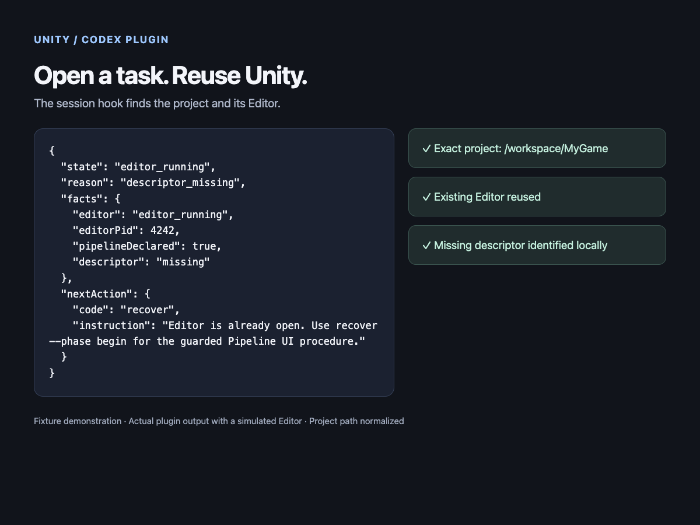
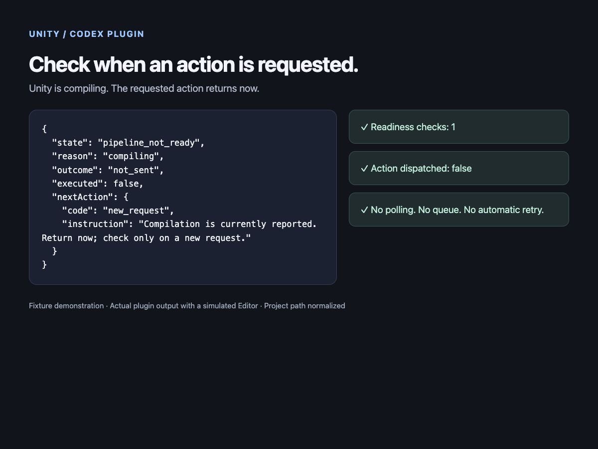
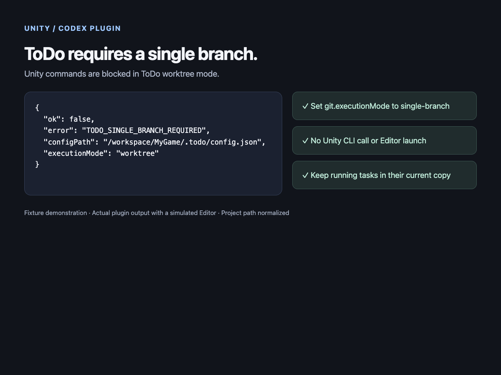

# Unity

A Codex plugin using the official Unity CLI → `com.unity.pipeline` → Unity Editor.
Session startup resolves the task's project and opens or reuses its Editor.
Pipeline readiness is checked on demand; there is no readiness polling, sleep,
queue, background retry or automatic command replay.

## Installation and configuration

Install `unity@blackbone` from this marketplace. Review and trust its SessionStart
hook, then start a new Codex task to load updated skills and hooks.
Requires Node.js 22+, the official `unity` CLI on PATH (or `UNITY_CLI` with its
executable path), a matching installed Unity 6+ Editor, and macOS or Linux.
CLI `1.0.0-beta.8` / Pipeline `0.6.0-exp.1` are the inspected contracts.
See the [official CLI installation documentation](https://docs.unity.com/en-us/unity-cli/use-unity-cli).
Windows, runtime Players and remote hosts are unsupported.

`$unity:init` explicitly installs a missing Pipeline package, preserving existing
versions. `$unity:editor` handles discovery and Editor commands. No custom MCP,
third-party console, additional Unity scripts, or persistent daemon is installed.

Every operation requires `--cwd <absolute-task-folder>`. Ambiguous selection
returns candidates; add `--project <exact-absolute-root>` only after selection.
Recognition uses Assets, ProjectSettings/ProjectVersion.txt and Packages/manifest.json.
The bounded search visits at most 200 eligible directories / two child levels,
skipping generated, hidden and symlinked child directories. Exact canonical paths
are used throughout; a checkout and worktree never satisfy one another's identity.

When ToDo is initialized, `.todo/config.json` must contain:

```json
{ "git": { "executionMode": "single-branch" } }
```

Default/worktree mode returns `TODO_SINGLE_BRANCH_REQUIRED`. Invalid or unreadable
policy fails closed. The guard checks ancestors, Git's main checkout for inherited
ignored configuration, and explicit target containment. Existing inherited ToDo
worktrees remain blocked after a mode change. Do not migrate active tasks or bypass
the guard with direct CLI/UI operations. No ToDo configuration is changed by this plugin.

## Usage and response contract

Resolve `<PLUGIN_ROOT>` from the supplied skill location, not the shell cwd.

```bash
node "<PLUGIN_ROOT>/scripts/cli.mjs" doctor --cwd "<task-folder>"
node "<PLUGIN_ROOT>/scripts/cli.mjs" open --cwd "<task-folder>"
node "<PLUGIN_ROOT>/scripts/cli.mjs" list --cwd "<task-folder>" --query editor_status --detail full
node "<PLUGIN_ROOT>/scripts/cli.mjs" run --cwd "<task-folder>" --input "<absolute-request.json>"
```

`doctor` and `status` share the same one-shot read-only diagnosis. `list` and `run`
already perform it; do not prepend another status call. `open` launches only if
process inspection finds no target Editor and no unidentified owner. Startup,
open and the launch worker use the same local diagnosis as command preflight.
Startup does not make a network probe; compaction restores context without opening.
AssetImportWorkerN / AssetImportWorkerHWN are excluded only by their exact `-name`.
Real batch-mode Editors remain owners; their actions may be unavailable through
CLI status. Unknown ownership blocks even when one known target Editor exists.

Existing `state`, `project`, `pid`, `ok` and `executed` fields remain. Diagnostics
add `reason` (machine code), `facts` (allowlisted observations), `nextAction` and
`requiresInteractive`. Descriptor/transport failures retain `state: pipeline_unavailable`;
confirmed busy states retain `pipeline_not_ready`. Consumers must use `reason`
and `nextAction`, not infer that `pipeline_unavailable` means the Editor is closed.
Raw CLI failures are no longer returned as result envelopes. Successful payloads
omit parameters, logs, warnings, error details and authentication fields.

| Reason | Observed fact / next step |
| --- | --- |
| editor_closed | No target or unidentified Editor; explicit open. |
| launching / launch_requested | Shared launch lease or recent request; no duplicate launch. |
| editor_unidentified / multiple_editors | Resolve ownership; never kill another Editor. |
| pipeline_missing | Dependency absent; explicit init only. |
| descriptor_missing / invalid / unreadable | Missing, malformed/bounded-invalid, or unreadable descriptor; inspect permissions or explicit recovery. |
| descriptor_pid_mismatch / descriptor_project_mismatch | Do not connect to that descriptor. |
| descriptor_stale | CLI reported unreachable and heartbeat is older than the diagnostic 30-second threshold; age alone never proves a dead server. |
| server_unreachable | One bounded request to the verified target socket failed. |
| authentication_failed | CLI authentication error or HTTP 401/403; never bypass auth. |
| compiling / domain_reload / settling | Current structured state; return without waiting. Settling does not prove compiler errors. |
| blocked_by_dialog | Current structured status confirms a modal; deliberate UI inspection. |
| protocol_incompatible | Explicit compatibility error or unsupported response shape, not a guessed version conflict. |
| pipeline_unavailable | CLI did not discover the exact Editor; cause still unknown. |
| ready | Process, descriptor PID/project and CLI ready instance agree. |

The diagnostic budget is shared across process inspection, ToDo checks, one CLI
status (maximum 2.5 seconds) and optional fallback GET (maximum 800 ms): 6 seconds.
Wrapper project resolution and pre-dispatch identity checks share that same deadline. No log scanning is used to label
current compilation, domain reload or Safe Mode. The fallback only contacts a
loopback socket whose listener PID was verified by the OS; it uses the real
descriptor token in memory. A successful fallback does not replace CLI readiness
or dispatch the original command. The official status handler may refresh its own
descriptor while servicing a read-only request.

Requests contain `{ "command": "editor_status", "args": [], "timeoutSeconds": 30 }`.
Discover the actual command/arguments first. Temporary JSON/C# belongs under
`<project>/Temp/CodexUnity/`, never Assets. Target/runtime overrides and detached
jobs are rejected. Commands have a separate 1–120-second timeout plus one second
of CLI overhead. `outcome` is `not_sent`, `succeeded`, `rejected`, or `unknown`.
Success requires both the CLI envelope and nested Pipeline success. Only explicit
pre-execution rejection codes are classified as rejected; failed custom code may
already have changed the project. Unknown results are never replayed automatically.

## Explicit connection recovery

CLI beta.8 has package install/upgrade/list operations but **no server start/stop
command**. Unavailable Pipeline cannot execute a command to repair its own connection.
The plugin therefore implements a guarded, explicit UI procedure:

```bash
node "<PLUGIN_ROOT>/scripts/cli.mjs" recover --cwd "<task-folder>" --phase begin
# Perform the returned UI instruction in the exact Editor, holding the returned lease.
node "<PLUGIN_ROOT>/scripts/cli.mjs" recover --cwd "<task-folder>" --phase finish --recovery-id "<returned-id>"
# If abandoning the procedure:
node "<PLUGIN_ROOT>/scripts/cli.mjs" recover --cwd "<task-folder>" --phase cancel --recovery-id "<returned-id>"
```

Begin diagnoses once and claims a project-local operation lease. Healthy connections
are left alone. Only eligible connection failures return `ui_required`, the exact
project/PID, and why UI is needed. `STATUS_NO_INSTANCES` alone never sets
`requiresInteractive`. In the confirmed Editor use **Window → Pipeline → Start Server**
if enabled. If already running, first establish that no other client command is
active, then deliberately **Stop Server → Start Server**. Do not stop/restart the
Editor. Finish performs one new diagnosis after that action; success requires the
same exact project, descriptor/Editor PID agreement and CLI readiness. A failed
verification retains the lease and returns immediately. Do not loop.

Hook/open, wrapper commands and recovery honor the same project-local operation
lock. Recovery IDs persist across CLI invocations and installed versions. Two
threads cannot begin recovery concurrently. A command's unknown outcome retains
its lease; doctor shows the operation ID. After the owning task has reconciled
possible side effects, it can explicitly cancel that lease. Cancellation does not
undo or resend the command. A crashed command owner is never automatically
unlocked; a live command owner cannot be cancelled. A damaged/missing owner record
fails closed and needs deliberate local lock investigation; no blind deletion.

External CLI/UI clients do not participate in this lock. The agent must establish
external quiescence before Stop/Start; if it cannot, leave recovery pending. The
plugin never automatically cycles a server, writes a fabricated descriptor,
cleans Library/Temp, reinstalls Pipeline or closes user Editors.

Launches have a separate shared lock and 30-second submission cooldown. The
one-shot launcher invokes official `unity open` with a 15-second bound and exits.
An explicit open can recover a dead stale launch lease after 30 seconds; it never
interrupts a live launcher. Launch requested is not proof of readiness.

## Descriptor investigation: confirmed mechanisms and unknown cause

Inspected installed Pipeline `0.6.0-exp.1` sources:

- `Runtime/Models/InstanceDescriptor.cs`: writes `Library/Pipeline/.unity-pipeline-port`
  via `File.WriteAllText` under a process-local write gate; creates its directory
  and restricts a new file to the current user. Writes are not atomic replacement.
  `RemoveFromProjectRoot` deletes it. Its static UpdateHeartbeat only updates an
  existing readable descriptor.
- `Editor/EditorPipelineServer.cs`: creates/writes on server startup, deletes on
  shutdown, and rewrites from its in-memory descriptor on status/heartbeat requests,
  refreshing the current authentication token. This can recreate a missing file
  if a legitimate authenticated client can still reach that server.
- `Editor/EditorPipelineStartup.cs`: stale cleanup can delete a descriptor when its
  PID is dead **or process inspection throws**. Menu Stop/Start uses the official
  server lifecycle. Domain reload recreates static startup; before/after callbacks
  themselves do not explicitly stop the server in this inspected version.
- `Runtime/Common/BasePipelineServer.cs`: server Stop deletes its descriptor.
  There is no independent periodic descriptor heartbeat timer here.

Non-atomic writes can explain a transient partial read; cleanup, shutdown or other
clients are possible deletion paths. **The cause of the reported disappearance is
not established.** No causal incident trace was available, and the working project
was not disturbed to reproduce it. Better diagnostics and guarded recovery do not
fix or prove the upstream root cause. The packaged CLI is a native binary; its
installed help/output and the [official integration contract](https://github.com/Unity-Technologies/skills/blob/main/skills/unity-cli/references/integration-advanced.md)
were inspected; no matching CLI implementation source was available locally.

## Security, validation and limitations

Hook trust authorizes opening recognized trusted projects, which can import assets,
compile/run Editor scripts and generate Library/Temp data. The installed plugin is
immutable; launch/operation metadata stays in Library/CodexUnity. The plugin reads
the descriptor locally with a 64 KiB bound, rejects symlinks/nonregular files, and
never prints its contents, auth token, full process arguments or raw logs. Diagnosis
uses allowlisted fields only. Paths from project selection are intentional output.

Run `node --test plugins/unity/scripts/test.mjs`, repository `make test`, and the
current Codex plugin validator. Regression fixtures cover process identity,
AssetImportWorkers and real batch Editors, missing/invalid/mismatched descriptors,
transport/auth/protocol failures, current busy states, shared deadlines, hung
responses/descendants, nested command outcomes, parallel launches/operations,
explicit UI recovery leases, installed-copy hook/wrapper parity and ToDo/worktree
isolation. Fault injection is isolated from real projects.

Live validation details for the installed release are recorded in
[validation.md](validation.md). GUI menu recovery from the historical incident is
user-reported evidence; this release does not claim to have reproduced the incident,
proved its cause, or tested Linux live behavior or all Editor commands.

## Screenshots

Captured plugin fixture output, not a live Editor session:




